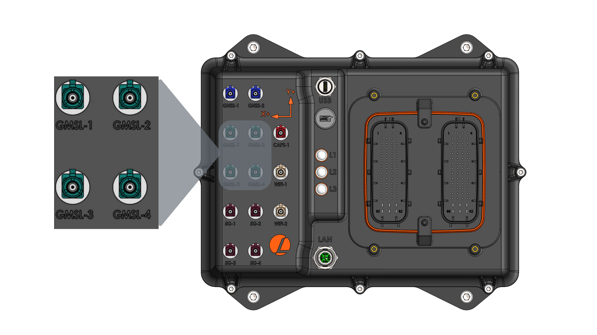
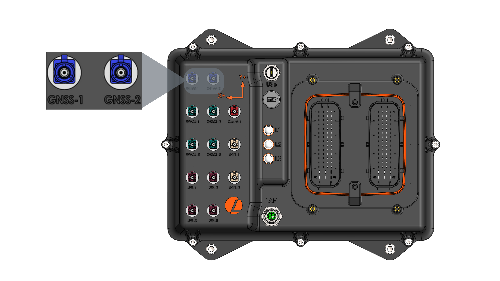
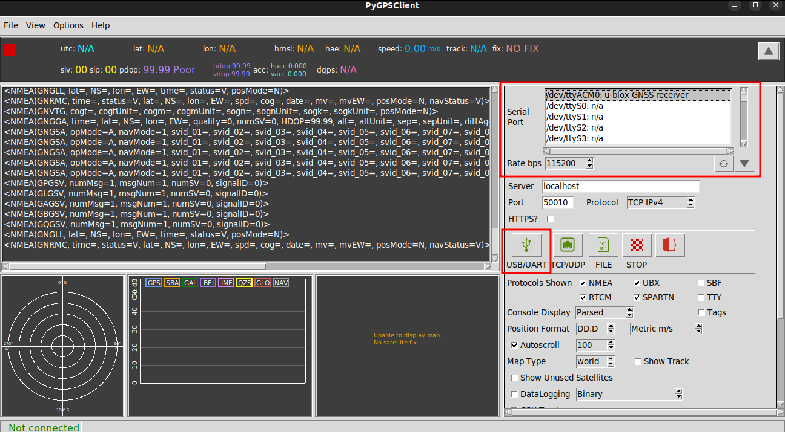
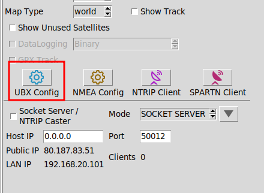
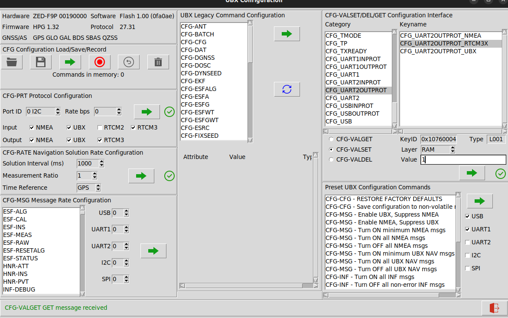
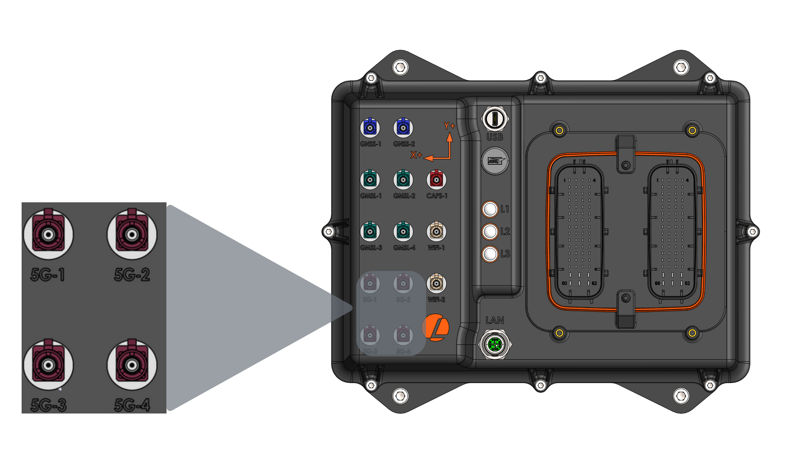

# --- /home/balachandra/lmws/docs/docs/system-overview.mdx ---

---
sidebar_position: 2
toc_max_heading_level: 5
---

# System Overview

import AutomateProImg from './images/AutomatePro_Breakout.png'

AutomatePro is a rugged, all-in-one ROS 2 platform designed for outdoor robotics and automation. It combines critical subsystems such as high-performance computing (with AI/ML acceleration), extensive I/O, an integrated 9-axis IMU and RTK GNSS, and robust IP67-rated housing. With support for 4G/5G, WiFi, Bluetooth, and a wide voltage input range, it provides a reliable and flexible foundation for advanced robotic applications. Pre-configured software tools ensure fast and seamless deployment.

The system’s integrated I/O significantly reduces the need for external components. Features include H-bridges or solid-state switches, digital and analog inputs/outputs, and support for warning systems (lights and sound). For navigation, it supports precise RTK GNSS (3–6 cm accuracy), dead reckoning via wheel inputs, differential heading, and satellite-based RTK correction—ideal for environments where magnetometers are unreliable.

AutomatePro supports a wide range of communication protocols including CAN, Ethernet, RS485, GMSL2, and USB 3.0. This makes it easy to connect with cameras, LIDARs, radars, motor controllers, and remote monitoring systems. Internally, it includes two regulated power outputs (12V and 5V) with voltage and current monitoring to support additional peripherals like sensors or actuators.

Available with four levels of compute based on the Nvidia [Jetson Orin Series](https://developer.nvidia.com/embedded/jetson-modules) (from Nano 4GB to Orin NX 16GB), AutomatePro comes preloaded with JetPack 6.0 and ROS 2 drivers for all onboard hardware. These drivers are pre-installed and tested, offered by default in Docker containers for modular updates and maintenance. For advanced users, native host execution is also supported. 

An overview of the AutomatePro


### Features

Depending on the configuration, the AutomatePro can be equipped with the following features


<div style={{ columnCount: 2, columnGap: '20px' }}>
  <p>
    <strong>Software:</strong><br />
    - Base ROS 2 drivers for all sensors and IO<br />
    - Linux Ubuntu 22.04<br />
    - Jetpack 6.0<br /><br />

    <strong>Sensors:</strong><br />
    - 9 axis IMU (3 axis Compass, 3 axis Gyro, 3 axis Accelerometer)<br />
    - GNSS RTK positioning (Wheel tick and direction input optional)<br />
    - GNSS Heading<br />
    - 2x or 4x GMSL2 Camera Inputs with PoC (Power Over Coax)<br /><br />

    <strong>Integrated IO:</strong><br />
    - 10x Digital Inputs<br />
    - 12x Digital Outputs(~500mA)<br />
    - 12x Digital Drive software configurable as half or full-Bridge (7A)<br />
    - 14x Analog Inputs (0-10V or 4-20mA(on request))<br />
    - E-stop Input<br />
    - Warning Light and Buzzer Drivers<br /><br />

    <strong>Connectivity:</strong><br />
    - 5G/4G Connectivity<br />
    - WiFi<br />
    - Bluetooth<br />
    - RS485<br />
    - CAN FD Bus<br />
    - 1GbE Ethernet<br />
    - USB 3.1 with Alt Mode for display port connection.<br /><br />

    <strong>Power System:</strong><br />
    - 15.5V to 58V Supply Voltage Range<br />
    - Extensive power supply monitoring with current and voltage sensing on most onboard power supplies and all external facing supplies<br />
    - 12V 8A Onboard power supply for external systems<br />
    - 5V 3A onboard power supply for external systems<br /><br />

    <strong>Environmental:</strong><br />
    - IP67 water ingress protection<br />
    - Robust keyed connectors to prevent systems from being incorrectly connected<br /><br />

    <strong>Market Ready:</strong><br />
    - Rapid development with dev tool kit
    - Range of supported external sensors and components 
  </p>
</div>


## Hardware Architecture

A high level layout of the AutomatePro showing the interconnections of the different systems. The diagram shows most of the IO being controlled by the 
MCU while the high bandwidth systems such as GMSL, USB3, WiFi, GbE being fed directly to the Jetson SOM. Between the MCU and SOM is a communication 
bridge facilitating the transfer of data. This bridge is initiated on start-up.

import AutomatePro_Hardware_Diagram_Connection_Overview from './images/AutomatePro_Hardware_Diagrams_Connection_Overview.png'


<br/>
<br/>

A simplified layout of the internal power’s supplies on the AutomatePro can be seen below - note, this only includes the power 
supplies that are relevant to the external systems and ignore regulators for onboards systems. The diagram also shows the onboard 
measurements of both current and voltage of the different rails along with onboard fuses.

import AutomatePro_Hardware_Diagram_PSU from './images/AutomatePro_Hardware_Diagram_PSU.png'


<br/>
<br/>


### Connector Pin Map & Functions
The two primary connectors used on the AutomatePro are from the TE Leavyseal connector series. The number allocation is given:

import connector_def from './images/Connector_Definition.png' 

 

#### Connector A
import ReactTable from './components/sortable_table';         

<ReactTable
  columns={[
    {
      Header: 'PIN NO.',
      accessor: 'pinNo',
    },
    {
      Header: 'PIN NAME',
      accessor: 'pinName',
    },
    {
      Header: 'I/O TYPE',
      accessor: 'ioType',
    },
    {
      Header: 'DESCRIPTION',
      accessor: 'description',
    },
  ]}
  data={[
  { pinNo: 'A1', pinName: 'NC', ioType: 'N/A', description: 'Not Connected' },
  { pinNo: 'A2', pinName: '+12V', ioType: 'Power Out', description: '12V out with 0.75A self-resetting fuse' },
  { pinNo: 'A3', pinName: 'GND', ioType: 'Ground', description: 'Sensor Ground' },
  { pinNo: 'A4', pinName: 'AIN_01', ioType: 'Input', description: '0-10V analog input (or 4-20mA on request)' },
  { pinNo: 'A5', pinName: 'E-STOP', ioType: 'Input', description: 'E-Stop button sensor for detecting when E-Stop has been pressed.' },
  { pinNo: 'A6', pinName: '+12V', ioType: 'Power Out', description: '12V out with 0.75A self-resetting fuse' },
  { pinNo: 'A7', pinName: 'GND', ioType: 'Ground', description: 'Sensor Ground' },
  { pinNo: 'A8', pinName: 'AIN_02', ioType: 'Input', description: '0-10V analog input (or 4-20mA on request)' },
  { pinNo: 'A9', pinName: 'GND', ioType: 'Ground', description: '' },
  { pinNo: 'A10', pinName: '+12V', ioType: 'Power Out', description: '12V out with 0.75A self resetting fuse' },
  { pinNo: 'A11', pinName: 'GND', ioType: 'Ground', description: 'Sensor Ground' },
  { pinNo: 'A12', pinName: 'AIN_03', ioType: 'Input', description: '0-10V analog input (or 4-20mA on request)' },
  { pinNo: 'A13', pinName: 'RS485_P', ioType: 'Input/Output', description: 'RS485 serial communications' },
  { pinNo: 'A14', pinName: '+12V', ioType: 'Power Out', description: '12V out with 0.75A self-resetting fuse' },
  { pinNo: 'A15', pinName: 'GND', ioType: 'Ground', description: 'Sensor Ground' },
  { pinNo: 'A16', pinName: 'AIN_04', ioType: 'Input', description: '0-10V analog input (or 4-20mA on request)' },
  { pinNo: 'A17', pinName: 'RS485_N', ioType: 'Input/Output', description: 'RS485 serial communications' },
  { pinNo: 'A18', pinName: '+12V', ioType: 'Power Out', description: '12V out with 0.75A self-resetting fuse' },
  { pinNo: 'A19', pinName: 'GND', ioType: 'Ground', description: 'Sensor Ground' },
  { pinNo: 'A20', pinName: 'AIN05', ioType: 'Input', description: '0-10V analog input (or 4-20mA on request)' },
  { pinNo: 'A21', pinName: 'GND', ioType: 'Ground', description: '' },
  { pinNo: 'A22', pinName: '+12V', ioType: 'Power Out', description: '12V out with 0.75A self-resetting fuse' },
  { pinNo: 'A23', pinName: 'GND', ioType: 'Ground', description: 'Sensor Ground' },
  { pinNo: 'A24', pinName: 'AIN06', ioType: 'Input', description: '0-10V analog input (or 4-20mA on request)' },
  { pinNo: 'A25', pinName: 'CAN1_L', ioType: 'Input/Output', description: 'CAN channel 1 communications' },
  { pinNo: 'A26', pinName: '+12V', ioType: 'Power Out', description: '12V out with 0.75A self-resetting fuse' },
  { pinNo: 'A27', pinName: 'GND', ioType: 'Ground', description: 'Sensor Ground' },
  { pinNo: 'A28', pinName: 'AIN07', ioType: 'Input', description: '0-10V analog input (or 4-20mA on request)' },
  { pinNo: 'A29', pinName: 'CAN1_H', ioType: 'Input/Output', description: 'CAN channel 1 communications' },
  { pinNo: 'A30', pinName: '+5V', ioType: 'Power Out', description: '5V out with 0.75A self-resetting fuse' },
  { pinNo: 'A31', pinName: 'GND', ioType: 'Ground', description: 'Sensor Ground' },
  { pinNo: 'A32', pinName: 'AIN08', ioType: 'Input', description: '0-10V analog input (or 4-20mA on request)' },
  { pinNo: 'A33', pinName: 'GND', ioType: 'Ground', description: '' },
  { pinNo: 'A34', pinName: '+5V', ioType: 'Power Out', description: '5V out with 0.75A self resetting fuse' },
  { pinNo: 'A35', pinName: 'GND', ioType: 'Ground', description: 'Sensor Ground' },
  { pinNo: 'A36', pinName: 'AIN09', ioType: 'Input', description: '0-10V analog input (or 4-20mA on request)' },
  { pinNo: 'A37', pinName: 'CAN2_L', ioType: 'Input/Output', description: 'CAN channel 2 communications' },
  { pinNo: 'A38', pinName: '+5V', ioType: 'Power Out', description: '5V out with 0.75A self-resetting fuse' },
  { pinNo: 'A39', pinName: 'GND', ioType: 'Ground', description: 'Sensor Ground' },
  { pinNo: 'A40', pinName: 'AIN10', ioType: 'Input', description: '0-10V analog input (or 4-20mA on request)' },
  { pinNo: 'A41', pinName: 'CAN2_H', ioType: 'Input/Output', description: 'CAN channel 2 communications' },
  { pinNo: 'A42', pinName: '+5V', ioType: 'Power Out', description: '5V out with 0.75A self-resetting fuse' },
  { pinNo: 'A43', pinName: 'GND', ioType: 'Ground', description: 'Sensor Ground' },
  { pinNo: 'A44', pinName: 'AIN11', ioType: 'Input', description: '0-10V analog input (or 4-20mA on request)' },
  { pinNo: 'A45', pinName: 'GND', ioType: 'Ground', description: '' },
  { pinNo: 'A46', pinName: '+5V', ioType: 'Power Out', description: '5V out with 0.75A self-resetting fuse' },
  { pinNo: 'A47', pinName: 'GND', ioType: 'Ground', description: 'Sensor Ground' },
  { pinNo: 'A48', pinName: 'AIN12', ioType: 'Input', description: '0-10V analog input (or 4-20mA on request)' },
  { pinNo: 'A49', pinName: 'NC', ioType: 'N/A', description: 'Do not connect' },
  { pinNo: 'A50', pinName: '+5V', ioType: 'Power Out', description: '5V out with 0.75A self-resetting fuse' },
  { pinNo: 'A51', pinName: 'GND', ioType: 'Ground', description: 'Sensor Ground' },
  { pinNo: 'A52', pinName: 'AIN13', ioType: 'Input', description: '0-10V analog input (or 4-20mA on request)' },
  { pinNo: 'A53', pinName: 'NC', ioType: 'N/A', description: 'Do not connect' },
  { pinNo: 'A54', pinName: '+5V', ioType: 'Power Out', description: '5V out with 0.75A self-resetting fuse' },
  { pinNo: 'A55', pinName: 'GND', ioType: 'Ground', description: 'Sensor Ground' },
  { pinNo: 'A56', pinName: 'AIN14', ioType: 'Input', description: '0-10V analog input (or 4-20mA on request)' },
  { pinNo: 'A57', pinName: 'ACTU_PWR', ioType: 'Power Input', description: 'Power Supply for all Digital Drives' },
  { pinNo: 'A58', pinName: 'NC', ioType: 'N/A', description: 'Do not connect' },
  { pinNo: 'A59', pinName: 'NC', ioType: 'N/A', description: 'Do not connect' },
  { pinNo: 'A60', pinName: 'ACTU_PWR', ioType: 'Power Input', description: 'Power Supply for all Digital Drives' },
  { pinNo: 'A61', pinName: '+12V_IO_OUT', ioType: 'Power Out', description: '+12V out with 8A self-resetting fuse - Used for any high current applications' },
  { pinNo: 'A62', pinName: 'NC', ioType: 'N/A', description: 'Do not connect' },  
  ]}
/>
import AutomateProConnectorA from './images/AutomatePro_Connector_A.png' 

##### Connector A - Pin map looking top down
 
   


#### Connector B

  <ReactTable
  columns = {[
    {
      Header: 'PIN NO.',
      accessor: 'pinNo',
    },
    {
      Header: 'PIN NAME',
      accessor: 'pinName',
    },
    {
      Header: 'I/O TYPE',
      accessor: 'ioType',
    },
    {
      Header: 'DESCRIPTION',
      accessor: 'description',
    },
  ]}

  data = {[
    { pinNo: 'B1', pinName: 'DI_01', ioType: 'Input', description: 'Digital Inputs' },
    { pinNo: 'B2', pinName: 'DO_H_01', ioType: 'Output', description: 'Highside Digital Output @12V' },
    { pinNo: 'B3', pinName: 'DD_H_01', ioType: 'Output', description: 'High Current Drive Output' },
    { pinNo: 'B4', pinName: 'DD_L_01', ioType: 'Sink', description: 'High Current Sink' },
    { pinNo: 'B5', pinName: 'DI_02', ioType: 'Input', description: 'Digital Inputs' },
    { pinNo: 'B6', pinName: 'DO_H_02', ioType: 'Output', description: 'Highside Digital Output @12V' },
    { pinNo: 'B7', pinName: 'DD_H_02', ioType: 'Output', description: 'High Current Drive Output' },
    { pinNo: 'B8', pinName: 'DD_L_02', ioType: 'Sink', description: 'High Current Sink' },
    { pinNo: 'B9', pinName: 'DI_03', ioType: 'Input', description: 'Digital Inputs' },
    { pinNo: 'B10', pinName: 'DO_H_03', ioType: 'Output', description: 'Highside Digital Output @12V' },
    { pinNo: 'B11', pinName: 'DD_H_03', ioType: 'Output', description: 'High Current Drive Output' },
    { pinNo: 'B12', pinName: 'DD_L_03', ioType: 'Sink', description: 'High Current Sink' },
    { pinNo: 'B13', pinName: 'DI_04', ioType: 'Input', description: 'Digital Inputs' },
    { pinNo: 'B14', pinName: 'DO_H_04', ioType: 'Output', description: 'Highside Digital Output @12V' },
    { pinNo: 'B15', pinName: 'DD_H_04', ioType: 'Output', description: 'High Current Drive Output' },
    { pinNo: 'B16', pinName: 'DD_L_04', ioType: 'Sink', description: 'High Current Sink' },
    { pinNo: 'B17', pinName: 'DI_05', ioType: 'Input', description: 'Digital Inputs' },
    { pinNo: 'B18', pinName: 'DO_H_05', ioType: 'Output', description: 'Highside Digital Output @12V' },
    { pinNo: 'B19', pinName: 'DD_H_05', ioType: 'Output', description: 'High Current Drive Output' },
    { pinNo: 'B20', pinName: 'DD_L_05', ioType: 'Sink', description: 'High Current Sink' },
    { pinNo: 'B21', pinName: 'DI_06', ioType: 'Input', description: 'Digital Inputs' },
    { pinNo: 'B22', pinName: 'DO_H_06', ioType: 'Output', description: 'Highside Digital Output @12V' },
    { pinNo: 'B23', pinName: 'DD_H_06', ioType: 'Output', description: 'High Current Drive Output' },
    { pinNo: 'B24', pinName: 'DD_L_06', ioType: 'Sink', description: 'High Current Sink' },
    { pinNo: 'B25', pinName: 'DI_07', ioType: 'Input', description: 'Digital Inputs' },
    { pinNo: 'B26', pinName: 'DO_L_01', ioType: 'Sink', description: 'Low side Sink' },
    { pinNo: 'B27', pinName: 'DD_H_07', ioType: 'Output', description: 'High Current Drive Output' },
    { pinNo: 'B28', pinName: 'DD_L_07', ioType: 'Sink', description: 'High Current Sink' },
    { pinNo: 'B29', pinName: 'DI_08', ioType: 'Input', description: 'Digital Inputs' },
    { pinNo: 'B30', pinName: 'DO_L_02', ioType: 'Sink', description: 'Low side Sink' },
    { pinNo: 'B31', pinName: 'DD_H_08', ioType: 'Output', description: 'High Current Drive Output' },
    { pinNo: 'B32', pinName: 'DD_L_08', ioType: 'Sink', description: 'High Current Sink' },
    { pinNo: 'B33', pinName: 'DI_09', ioType: 'Input', description: 'Digital Inputs' },
    { pinNo: 'B34', pinName: 'DO_L_03', ioType: 'Sink', description: 'Low side Sink' },
    { pinNo: 'B35', pinName: 'DD_H_09', ioType: 'Output', description: 'High Current Drive Output' },
    { pinNo: 'B36', pinName: 'DD_L_09', ioType: 'Sink', description: 'High Current Sink' },
    { pinNo: 'B37', pinName: 'DI_10', ioType: 'Input', description: 'Digital Inputs' },
    { pinNo: 'B38', pinName: 'DO_L_04', ioType: 'Sink', description: 'Low side Sink' },
    { pinNo: 'B39', pinName: 'DD_H_10', ioType: 'Output', description: 'High Current Drive Output' },
    { pinNo: 'B40', pinName: 'DD_L_10', ioType: 'Sink', description: 'High Current Sink' },
    { pinNo: 'B41', pinName: 'NC', ioType: 'N/A', description: 'Not Connected' },
    { pinNo: 'B42', pinName: 'DO_L_05', ioType: 'Sink', description: 'Low side Sink' },
    { pinNo: 'B43', pinName: 'DD_H_11', ioType: 'Output', description: 'High Current Drive Output' },
    { pinNo: 'B44', pinName: 'DD_L_11', ioType: 'Sink', description: 'High Current Sink' },
    { pinNo: 'B45', pinName: 'NC', ioType: 'N/A', description: 'Not Connected' },
    { pinNo: 'B46', pinName: 'DO_L_06', ioType: 'Sink', description: 'Low side Sink' },
    { pinNo: 'B47', pinName: 'DD_H_12', ioType: 'Output', description: 'High Current Drive Output' },
    { pinNo: 'B48', pinName: 'DD_L_12', ioType: 'Sink', description: 'High Current Sink' },
    { pinNo: 'B49', pinName: 'WARNING_LIGHT_1', ioType: 'Sink', description: 'High Current Sink for connecting external light' },
    { pinNo: 'B50', pinName: 'WARNING_LIGHT_2', ioType: 'Sink', description: 'High Current Sink for connecting external light' },
    { pinNo: 'B51', pinName: 'WHEEL_TICK', ioType: 'Input', description: 'Non standard. Contact Lemvos for more information' },
    { pinNo: 'B52', pinName: 'WHEEL_DIRECTION', ioType: 'Input', description: 'Non standard. Contact Lemvos for more information' },
    { pinNo: 'B53', pinName: 'NC', ioType: 'N/A', description: 'Not Connected' },
    { pinNo: 'B54', pinName: 'WARNING_BUZZER', ioType: 'Sink', description: 'High Current Sink for connecting external warning buzzer/alarm' },
    { pinNo: 'B55', pinName: 'NC', ioType: 'N/A', description: 'Not Connected' },
    { pinNo: 'B56', pinName: 'NC', ioType: 'N/A', description: 'Not Connected' },
    { pinNo: 'B57', pinName: 'VBATT', ioType: 'Power Input', description: 'Provides Power to the AutomatePro' },
    { pinNo: 'B58', pinName: 'NC', ioType: 'N/A', description: 'Not Connected' },
    { pinNo: 'B59', pinName: 'GND', ioType: 'Ground', description: 'AutomatePro ground' },
    { pinNo: 'B60', pinName: 'VBATT', ioType: 'Power Input', description: 'Provides Power to the AutomatePro' },
    { pinNo: 'B61', pinName: 'NC', ioType: 'N/A', description: 'Not Connected' },
    { pinNo: 'B62', pinName: 'GND', ioType: 'Ground', description: 'AutomatePro ground' },
  ]}
  />

  

import AutomateProConnectorB from './images/AutomatePro_Connector_B.png'

##### Connector B - Pin map looking top down


### Operating Conditions
The table provides both the absolute maximum and minimum limits, as well as the recommended operating conditions. It is strongly advised that nominal operations remain within the recommended operating values.
  <ReactTable
  columns = {[
    {
      Header: 'DESCRIPTION',
      accessor: 'description',
    },
    {
      Header: 'ABSOLUTE MAX/MINS',
      accessor: 'absoluteMaxMins',
    },
    {
      Header: 'RECOMMENDED OPERATING VALUES',
      accessor: 'recommendedOperatingValues',
    },
    {
      Header: 'UNITS',
      accessor: 'units',
    },
    {
      Header: 'TOLERANCE',
      accessor: 'tolerance',
    },
  ]}

  data = {[  {
    description: 'Main AutomatePro Power Input [VBATT]',
    absoluteMaxMins: '',
    recommendedOperatingValues: '',
    units: '',
    tolerance: '',
  },
  {
    description: 'Supply Voltage Range',
    absoluteMaxMins: '15.00-60',
    recommendedOperatingValues: '15.5-58',
    units: 'VDC',
    tolerance: '',
  },
  {
    description: 'Expected Power Consumption',
    absoluteMaxMins: '',
    recommendedOperatingValues: '10-200¹',
    units: 'W',
    tolerance: '',
  },
  {
    description: 'Actuator Power Input (Digital Drive) [ACTU_PWR]',
    absoluteMaxMins: '',
    recommendedOperatingValues: '',
    units: '',
    tolerance: '',
  },
  {
    description: 'Voltage Range',
    absoluteMaxMins: '6-60',
    recommendedOperatingValues: '7-42',
    units: 'VDC',
    tolerance: '',
  },
  {
    description: 'Max Current',
    absoluteMaxMins: '60',
    recommendedOperatingValues: '55',
    units: 'A',
    tolerance: '',
  },
  {
    description: 'IO 5V Supply Output [+5V]',
    absoluteMaxMins: '',
    recommendedOperatingValues: '',
    units: '',
    tolerance: '',
  },
  {
    description: 'Output Voltage',
    absoluteMaxMins: '-',
    recommendedOperatingValues: '5',
    units: 'VDC',
    tolerance: '0.5',
  },
  {
    description: 'Current Cutoff',
    absoluteMaxMins: '-',
    recommendedOperatingValues: '3',
    units: 'A',
    tolerance: '',
  },
  {
    description: 'IO 12V Supply Output [+12V]',
    absoluteMaxMins: '',
    recommendedOperatingValues: '',
    units: '',
    tolerance: '',
  },
  {
    description: 'Output Voltage',
    absoluteMaxMins: '-',
    recommendedOperatingValues: '12',
    units: 'VDC',
    tolerance: '0.5',
  },
  {
    description: 'Current Cutoff',
    absoluteMaxMins: '-',
    recommendedOperatingValues: '8',
    units: 'A',
    tolerance: '',
  },
  {
    description: 'Digital Output [DO_H_01-06]',
    absoluteMaxMins: '',
    recommendedOperatingValues: '',
    units: '',
    tolerance: '',
  },
  {
    description: 'Output Voltage',
    absoluteMaxMins: '-',
    recommendedOperatingValues: '12.0',
    units: 'VDC',
    tolerance: '0.5',
  },
  {
    description: 'Max Current Source',
    absoluteMaxMins: '-',
    recommendedOperatingValues: '600.0',
    units: 'mA',
    tolerance: '',
  },
  {
    description: 'PWM Frequency',
    absoluteMaxMins: '-',
    recommendedOperatingValues: '0.5',
    units: 'kHz',
    tolerance: '',
  },
  {
    description: 'Duty Cycle',
    absoluteMaxMins: '-',
    recommendedOperatingValues: '0-100',
    units: '%',
    tolerance: '',
  },
  {
    description: 'Software Response Rate',
    absoluteMaxMins: '-',
    recommendedOperatingValues: '200.0',
    units: 'ms',
    tolerance: '',
  },
  {
    description: 'Digital Output [DO_L_01-06]',
    absoluteMaxMins: '',
    recommendedOperatingValues: '',
    units: '',
    tolerance: '',
  },
  {
    description: 'Sink Voltage',
    absoluteMaxMins: '0-60',
    recommendedOperatingValues: '0-42',
    units: 'VDC',
    tolerance: '',
  },
  {
    description: 'Max Current Sink',
    absoluteMaxMins: '1000',
    recommendedOperatingValues: '600.0',
    units: 'mA',
    tolerance: '',
  },
  {
    description: 'PWM Frequency (DO_L_01-04)',
    absoluteMaxMins: '-',
    recommendedOperatingValues: '15.0',
    units: 'kHz',
    tolerance: '',
  },
  {
    description: 'Duty Cycle',
    absoluteMaxMins: '-',
    recommendedOperatingValues: '0-100',
    units: '%',
    tolerance: '',
  },
  {
    description: 'Software Response Rate',
    absoluteMaxMins: '-',
    recommendedOperatingValues: '200.0',
    units: 'ms',
    tolerance: '',
  },
  {
    description: 'Digital Drive [DD_x_xx]',
    absoluteMaxMins: '',
    recommendedOperatingValues: '',
    units: '',
    tolerance: '',
  },
  {
    description: 'Drive Voltage',
    absoluteMaxMins: '6-60',
    recommendedOperatingValues: '7-42',
    units: 'VDC',
    tolerance: '',
  },
  {
    description: 'Rated Current/Channel',
    absoluteMaxMins: '7',
    recommendedOperatingValues: '5.0',
    units: 'A',
    tolerance: '',
  },
  {
    description: 'PWM Frequency',
    absoluteMaxMins: '-',
    recommendedOperatingValues: '15.0',
    units: 'kHz',
    tolerance: '',
  },
  {
    description: 'Duty Cycle',
    absoluteMaxMins: '-',
    recommendedOperatingValues: '0-100',
    units: '%',
    tolerance: '',
  },
  {
    description: 'Software Response Rate',
    absoluteMaxMins: '-',
    recommendedOperatingValues: '200.0',
    units: 'ms',
    tolerance: '',
  },
  {
    description: 'Warning System',
    absoluteMaxMins: '',
    recommendedOperatingValues: '',
    units: '',
    tolerance: '',
  },
  {
    description: 'Drive Voltage',
    absoluteMaxMins: '0-40',
    recommendedOperatingValues: '0-24',
    units: 'VDC',
    tolerance: '',
  },
  {
    description: 'Rated Current/Channel',
    absoluteMaxMins: '5',
    recommendedOperatingValues: '3.0',
    units: 'A',
    tolerance: '',
  },
  {
    description: 'Software Response Rate',
    absoluteMaxMins: '-',
    recommendedOperatingValues: '200.0',
    units: 'ms',
    tolerance: '',
  },
  {
    description: 'Analog Inputs [AIN_xx]',
    absoluteMaxMins: '',
    recommendedOperatingValues: '',
    units: '',
    tolerance: '',
  },
  {
    description: 'Input Voltage',
    absoluteMaxMins: '0-12',
    recommendedOperatingValues: '0-10',
    units: 'VDC',
    tolerance: '',
  },
  {
    description: 'Sample Rate',
    absoluteMaxMins: '-',
    recommendedOperatingValues: '30.0',
    units: 'Hz',
    tolerance: '',
  },
  {
    description: 'Digital Input [DI_xx]',
    absoluteMaxMins: '',
    recommendedOperatingValues: '',
    units: '',
    tolerance: '',
  },
  {
    description: 'Input Voltage Range',
    absoluteMaxMins: '5-30',
    recommendedOperatingValues: '5-24',
    units: 'VDC',
    tolerance: '1',
  },
  {
    description: 'Max Sample Rate',
    absoluteMaxMins: '-',
    recommendedOperatingValues: '10',
    units: 'Hz',
    tolerance: '',
  },
  {
    description: 'Environmental',
    absoluteMaxMins: '',
    recommendedOperatingValues: '',
    units: '',
    tolerance: '',
  },
  {
    description: 'Operational Temperature Range',
    absoluteMaxMins: '',
    recommendedOperatingValues: '-20 to +45²',
    units: '°C',
    tolerance: '',
  },
  {
    description: 'Ingress Protection',
    absoluteMaxMins: '',
    recommendedOperatingValues: 'IP67',
    units: '-',
    tolerance: '',
  },
  {
    description: 'Mass',
    absoluteMaxMins: '',
    recommendedOperatingValues: '2.2',
    units: 'kg',
    tolerance: '',
  },
  
  ]}
  />
:::info[Info]
<sup>1</sup> The power consumption is highly dependent on the external systems attached - without any external systems connected the max consumption is < 30W(NX 16GB). 

<sup>2</sup> Extended temperature device exists, contact lemvos for more information
:::
### LED Functions

import LEDs from './images/LEDs.png'

<div style={{ columnCount: 2, columnGap: '20px'}}>
  <p>
    <strong></strong><br />
| LED Designator | LED Colour | Function                                      |
|----------------|------------|-----------------------------------------------|
| L1             | GREEN      | Power Good - checks all onboard power supplies   |
| L1             | BLUE       | WIFI - WLAN                                   |
| L1             | RED        | nE-STOP - LED will be off when E-STOP is pressed (E-STOP input low) |
| L2             | BLUE       | Ethernet Link                                 |
| L2             | RED        | Ethernet ACT                                  |
| L3             | GREEN      | SSD Read/Write LED                            |
| L3             | BLUE       | WWAN - 5G RF function is on                   |
| L3             | RED        | WIFI - Bluetooth                              |


    <strong></strong><br />
      
    
    </p>
</div>


### Dimensions

import AMP_GA from './images/AMP-100-AMP-ASSY-REV-A.png' 


All dimensions are in millimeters (mm).


### Compute Modules
AutomatePro supports a range of NVIDIA Jetson Orin modules, each catering to different performance and resource requirements. 

Supported NVIDIA Jetson Orin Modules
- Jetson Orin Nano 4GB
- Jetson Orin Nano 8GB
- Jetson Orin NX 8GB
- Jetson Orin NX 16GB

:::info[Info]
For more information on the performance of the different modules, please refer to the [Jetson Orin Series Page](https://developer.nvidia.com/embedded/jetson-modules)
:::

## Software Architecture

import SoftwareArchImg from './images/software-arch.png'


<div className="image-container">
  
</div>

### OS
AutomatePro operates on Jetson Linux 36.3, which features the Linux Kernel 5.15 and an Ubuntu 22.04 based root filesystem. 
This OS is optimized for the NVIDIA Jetson platform and includes all necessary drivers and libraries pre-installed, ensuring seamless integration 
and performance.  

For more information, refer to the [NVIDIA Developer Guide](https://docs.nvidia.com/jetson/archives/r36.3/DeveloperGuide/index.html)

Jetson Linux 36.3 is part of the [NVIDIA JetPack SDK (ver. 6.0)](https://developer.nvidia.com/embedded/jetpack), which provides a comprehensive set of tools and libraries for developing end-to-end accelerated 
AI and ML applications on the Jetson platform.

The kernel is configured with the PREEMPT_RT patch to ensure low-latency and high-priority task execution, 
which is crucial for real-time robotics applications.
For more information on the PREEMPT_RT patch, refer to the [official documentation](https://wiki.linuxfoundation.org/realtime/start).

AutomatePro is pre flashed with the compatible OS. However, if required, the OS can be manually flashed. Refer to the 
[flashing guide](./manual/diagnostics/flashing.mdx) for detailed instructions.

### ROS 2
AutomatePro is ROS 2 native and provides necessary abstractions to interact with the hardware.
Below is a high-level overview of the ROS 2 nodes.


import ROSImg2 from './images/ros2-overview2.png'

<div className="image-container">
  
</div>
### Docker
AutomatePro leverages Docker for containerized deployment, enhancing ease of deployment, scalability, and management.

#### Containers
By default, all ROS 2 nodes and other services run in Docker containers. 
However, it is also possible to run the nodes directly on the host system if required.

All the docker compose files can be found in the `/opt/automatepro` directory. These are further orchestrated using `systemd` services.
- `automatepro-core-driver.service` - Core driver nodes for handling GNSS, IMU, Cameras, etc.
- `automatepro-io-agent.service` - IO agent for handling digital and analog I/Os, warning systems, etc.
- `automatepro-ros-utils.service` - ROS 2 utilities such as foxglove bridge, visualization nodes, etc.

##### Core Driver
`automatepro-core-driver` container is responsible for running all the essential drivers abstracting the hardware to the ROS 2 nodes.

- [RTK Positioning](./manual/sensors/gnss/position.mdx)
- [RTK Heading](./manual/sensors/gnss/heading.mdx)
- [RTK Correction](./manual/sensors/gnss/correction.mdx)
- [IMU](./manual/sensors/imu.mdx)
- [GMSL2 Camera](./manual/sensors/gmsl2-camera.mdx)

##### IO Agent
The `automatepro-io-agent` container is responsible for the communication between ROS 2 and the micro-ROS nodes running on the MCU, which handles analog and digital I/Os, warning systems, etc. 

Refer the links for more details on IO capabilities.
- [Analog Input](./manual/io/analog-in.mdx)
- [Digital Input](./manual/io/digital-in.mdx)
- [Digital Output](./manual/io/digital-out.mdx)
- [Digital Drive Out](./manual/io/digital-drive-out.mdx)
- [Warning Systems](./manual/io/warning-systems.mdx)

##### ROS Utils
`automatepro-ros-utils` container is responsible for running the ROS 2 utilities such as foxglove bridge, visualization nodes, etc.
This will help you to get started as shown in the [Quick Start Guide](./quick-start-guide.mdx). It is recommended to remove this container in production with following command:
```bash
sudo systemctl disable automatepro-ros-utils.service
docker rm -f automatepro-ros-utils
```


# --- /home/balachandra/lmws/docs/docs/release-notes.mdx ---

---
sidebar_position: 3
---

# Release Notes

Stay up to date with the latest changes and improvements.

## Software

### Version 1.0.1
- Added an installer to automate initial setup and streamline future updates.
- Enhanced IO Controller with new features for flexible analog and digital input configuration.
- Resolved minor bugs to improve overall stability and reliability.

### Version 1.0.0
- First official release
- Core features implemented

# --- /home/balachandra/lmws/docs/docs/quick-start-guide.mdx ---

---
sidebar_position: 2
---

# Quick Start Guide

Welcome to **AutomatePro**.This guide provides clear, step-by-step instructions to help you set up and begin using your AutomatePro system quickly.

The AutomatePro offers two connection options. The Production version uses TE Leavyseal connectors, providing full IP67 protection. The second option is intended primarily for prototyping and rapid development, utilizing terminal blocks for easier connectivity.

Both options are interchangeable; however, for the purposes of this Quick Start Guide, the Development Board version will be used.

<div style={{ columnCount: 2, columnGap: '150px' }}>
<div>
    <p><strong>AutomatePro with Development Board</strong></p>
    
  </div>
  <div>
    <p><strong>AutomatePro with TE Leavyseal</strong></p>
    
  </div>
</div>

## What's in the Box

This will depend on what you have ordered, but for the purposes of this Quick Start Guide, we will assume the following components:

- **AutomatePro Main Unit**
- **Power Supply**
- **Ethernet Cable**
- **Optional Accessories** (varies by configuration)

These are as follows

import automateproComponentsImg from './images/automatepro-components-1.png';
import automateproDevBoardImg from './images/automatepro_dev_board.png';
import automateproCLeavySealImg from './images/automatepro_TE_Leavyseal.png';


## Connecting AutomatePro

### Hardware Connection

Use the provided power supply and Ethernet cable to connect your AutomatePro device, as shown in the illustration below.

1. **Connect the Breakout Board (if applicable):**  
   If your configuration includes a breakout board, securely attach it to the AutomatePro unit. Ensure all pins are properly aligned before applying pressure to avoid damage.

import connectBreakoutBoard from './gifs/connect-breakout-board.gif';

<div style={{ display: 'flex', justifyContent: 'center',padding: '20px', margin: '0px 0px 30px 0px' }}>
    
</div>

2. **Connect Fakra Antennas (GNSS, WiFi, 5G antennas and Cameras):**  
   Attach the Fakra connectors to their designated ports. These connectors are color-coded for easy identification. Make sure each connector is fully inserted and securely locked to ensure a stable and reliable connection.

import connectFakra from './gifs/connect-fakra.gif';

<div style={{ display: 'flex', justifyContent: 'center',padding: '20px', margin: '0px 0px 30px 0px' }}>
    
</div>

3. **Connect the Ethernet Cable:**  
   Use the supplied Ethernet cable to establish a wired network connection. Insert one end into the AutomatePro unit and the other into your network router or switch.

import connectEthernet from './gifs/connect-ethernet-cable.gif';

<div style={{ display: 'flex', justifyContent: 'center',padding: '20px', margin: '0px 0px 30px 0px' }}>
    
</div>

4. **Connect the Power Supply:**  
   Plug the provided power supply into the AutomatePro unit. Ensure that the connector polarity aligns with the labeled indicators to prevent improper connection.

import connectPowerSUpply from './gifs/connect-power-supply.gif';

<div style={{ display: 'flex', justifyContent: 'center', padding: '20px', margin: '0px 0px 30px 0px' }}>
    
</div>

5. **Power On AutomatePro:**  
   Once all connections are in place, turn on the power supply to start the AutomatePro unit. The device will begin its boot-up sequence, and the status LEDs will start blinking.  
   Refer to the [Status LED functions](/automatepro/system-overview#led-functions) for more information on interpreting LED behavior.

### Accessing AutomatePro

Once powered on and connected to the network, AutomatePro will receive an IP address from your network’s DHCP server. You can identify this IP address by:

    - Checking the DHCP client list on your router.
    - Using a network scanning tool such as `nmap` or `arp-scan` to detect connected devices on your network.

    After locating the IP address, you can access AutomatePro through either **SSH** (command-line interface) or **Remote Desktop** (graphical interface).

#### SSH (Command-Line Access)

For terminal-based access, use SSH to connect remotely to AutomatePro.


        ```bash
        ssh admin@<ip-address>
        ```
    * Remote Desktop (Graphical Access)  
    For GUI access, follow the instructions in the [Remote Desktop Guide](/automatepro/manual/misc/desktop#remote-desktop).

:::info
default credentials:
```
username: admin
password: password
```
:::warning[Important]
Please change the password after the first login.
:::


To configure WiFi, refer to the [WiFi Setup Guide](/automatepro/manual/connectivity/wifi#using-nm-cli).

## Foxglove Interface

AutomatePro can be monitored and controlled using [Foxglove Studio](https://foxglove.dev/), a powerful visualization and observability tool designed for robotics applications.

1. **Install Foxglove Studio**  
   Download and install Foxglove Studio from the [official website](https://foxglove.dev/download). Follow the installation instructions appropriate for your operating system.

2. **Import Dashboards and Extensions**  
   Download the AutomatePro Foxglove extension and preconfigured dashboards from the [GitHub repository](https://github.com/Lemvos/automatepro_foxglove).  
   Import both into Foxglove Studio by following the steps provided in the video tutorial below or in the [official documentation](https://github.com/Lemvos/automatepro_foxglove).

import foxgloveInstallation from './gifs/foxglove-installation.gif';

<div style={{ display: 'flex', justifyContent: 'center', padding: '20px', margin: '0px 0px 30px 0px' }}>
    
</div>

3. Connect to AutomatePro  
    Connect Foxglove Studio to AutomatePro by entering the IP address and port number in the connection dialog.
    ```bash
    ws://<ip-address>:8765
    ```
<div style={{ display: 'flex', justifyContent: 'center', margin: '0px 0px 30px 0px' }}>
    <iframe width="100%" style={{"aspect-ratio": "16 / 9", "justifyContent": 'center', "padding": '20px', "margin": '0px 0px 30px 0px'}} 
        src="https://www.youtube.com/embed/WDgLLtXSkhQ?si=cR46lrNCMHGbpyEx" title="YouTube video player" 
        frameborder="0" allow="accelerometer; autoplay; clipboard-write; encrypted-media; gyroscope; picture-in-picture; web-share" 
        referrerpolicy="strict-origin-when-cross-origin" allowfullscreen>
    </iframe>
</div>

# --- /home/balachandra/lmws/docs/docs/manual/io/warning-systems.mdx ---

---
sidebar_position: 5
---

# Warning Systems

## Hardware 
import Tabs from '@theme/Tabs';
import TabItem from '@theme/TabItem';
import AutomatePro_DOut from './images/AutomatePro_DOut.png'
import BreakoutBoard_DOut from '../connectivity/images/BreakoutBoard-MISC.png'

Warning system outputs are configured to control standard components such as warning lights and buzzers. 
Two drivers are allocated for the lighting system, and one driver is designated for a warning buzzer/horn. 

###  Connector Pinout

<Tabs>
  <TabItem value="Connector" label="Connector" default>
   
    

</TabItem>
  <TabItem value="Development Breakout Board" label="Development Breakout Board">

    

  </TabItem>
</Tabs>

import WarningLight from './images/Warning_System.svg';
import WarningBuzzer from './images/Warning_Buzzer.svg';

    <strong></strong><br />
### Warning Systems Specifications
<div style={{ columnCount:3, columnGap: '20px' }}>
  <p>
    <strong></strong><br />
    | Parameter       | Value         |
    |-----------------|---------------|
    | Onstate     | Sinks up to 24V |
    | Drive Current      | 2A  |
    | Controllability  | ON/OFF  |
    | Number of Sinks | 3          |

    <strong></strong><br />
<WarningBuzzer style={{width: 'auto', height: '270px', paddingTop: '20px'}} />
  <WarningLight style={{width: 'auto', height: '340px',paddingBottom: '10px'}}/> 

  </p>
</div>
<br />


## ROS API

### Subscribers

|Topic | Type | Description  |
|---------|---------|---------|
|`/io/warning_system_out` | [`automatepro_interfaces/msg/WarningSystems`](https://github.com/Lemvos/automatepro_interfaces/blob/master/msg/WarningSystems.msg) | Publish the desired states for the warning system to this topic. <br/> <br/>  Inputs:<br/> `warning_system_id`: <br/> DataType: `uint8` <br/> _(Use ENUM constants defined in msg definition. Options `WarningSystems.WARNING_BUZZER`, `WarningSystems.WARNING_LIGHT1`, `WarningSystems.WARNING_LIGHT_2`)_ <br/> <br/> `state`: <br/> DataType: `bool` <br/> _(Use ENUM constants defined in msg definiton. Options `WarningSystems.ON`, `WarningSystems.OFF`)_ <br/> <br/> Response Rate: `200 ms` |


## Example

Example code snippet toggles the Warning Buzzer ON/OFF by publishing to the `/io/warning_system_out` topic.  
ROS package can be found [here](https://github.com/Lemvos/automatepro_tutorials).

<Tabs>
  <TabItem value="Python" label="Python" default>
    ```Python
    import rclpy
    from rclpy.node import Node
    from automatepro_interfaces.msg import WarningSystems

    class WarningSystemsPublisher(Node):

        def __init__(self):
            super().__init__('warning_systems_publisher')
            self.publisher_ = self.create_publisher(WarningSystems, '/io/warning_system_out', 10)
            self.timer = self.create_timer(1.0, self.timer_callback)  # 1s
            self.state = False

        def timer_callback(self):
            msg = WarningSystems()
            msg.warning_system_id = WarningSystems.WARNING_BUZZER
            msg.state = self.state
            self.publisher_.publish(msg)
            self.get_logger().info(
                'Publishing WarningSystems: warning_system_id=%d, state=%d' %
                (msg.warning_system_id, msg.state))
            self.state = not self.state # Toggle state

    def main(args=None):
        rclpy.init(args=args)
        node = WarningSystemsPublisher()
        rclpy.spin(node)
        node.destroy_node()
        rclpy.shutdown()

    if __name__ == '__main__':
        main()
    ```
    Run the node using the following command:

    ```bash
    ros2 run automatepro_python_tutorials warning_system_out_node 
    ```
  </TabItem>
  <TabItem value="C++" label="C++">
    ```cpp
    #include <rclcpp/rclcpp.hpp>
    #include <automatepro_interfaces/msg/warning_systems.hpp>

    class WarningSystemsPublisher : public rclcpp::Node
    {
    public:
        WarningSystemsPublisher()
            : Node("warning_systems_publisher"), state_(false)
        {
            publisher_ = this->create_publisher<automatepro_interfaces::msg::WarningSystems>("/io/warning_system_out", 10);
            timer_ = this->create_wall_timer(
                std::chrono::seconds(1),
                std::bind(&WarningSystemsPublisher::timer_callback, this));
        }

    private:
        void timer_callback()
        {
            auto msg = automatepro_interfaces::msg::WarningSystems();
            msg.warning_system_id = automatepro_interfaces::msg::WarningSystems::WARNING_BUZZER;  // Change to WARNING_LIGHT1 or WARNING_LIGHT2 as needed
            msg.state = state_;
            publisher_->publish(msg);
            RCLCPP_INFO(this->get_logger(), "Publishing WarningSystems: warning_system_id=%d, state=%d",
                        msg.warning_system_id, msg.state);
            state_ = !state_;  // Toggle state
        }

        rclcpp::Publisher<automatepro_interfaces::msg::WarningSystems>::SharedPtr publisher_;
        rclcpp::TimerBase::SharedPtr timer_;
        bool state_;
    };

    int main(int argc, char *argv[])
    {
        rclcpp::init(argc, argv);
        rclcpp::spin(std::make_shared<WarningSystemsPublisher>());
        rclcpp::shutdown();
        return 0;
    }

    ```
    Run the node using the following command:

    ```bash
    ros2 run automatepro_cpp_tutorials warning_system_out_node 
    ```
  </TabItem>
</Tabs>

# --- /home/balachandra/lmws/docs/docs/manual/io/digital-out.mdx ---

---
sidebar_position: 3
---

# Digital Out

## Hardware 
import Tabs from '@theme/Tabs';
import TabItem from '@theme/TabItem';
import AutomatePro_DOut from './images/AutomatePro_DOut.png'
import BreakoutBoard_DOut from './images/Breakout_Board_Digital_Outs.png'


The AutomatePro comes with 12x digital outputs for controlling external systems from small solenoids to LEDs or small DC motors. 
There are two different digital outputs available, one is setup as a highside output (DO_H_0x) which PWMs the onboard 12V as an output. 
The second is a Lowside sink (DO_L_0x) which sinks upto 36V with the first four being PWM controllable and 

###  Connector Pinout

<Tabs>
  <TabItem value="Connector" label="Connector" default>
   
    

</TabItem>
  <TabItem value="Development Breakout Board" label="Development Breakout Board">

    

  </TabItem>
</Tabs>

import DOx_Highside from './images/DO_H_x.svg';
import DOx_Lowside from './images/DO_L_x.svg';

### Digital Output Highside (DO_H_x) Specifications
There are 6x highside digital outputs with all 6 being PWM controllable switches.
<div style={{ columnCount: 2, columnGap: '20px' }}>
  <p>
    <strong></strong><br />
    | Parameter       | Value         |
    |-----------------|---------------|
    | Output Voltage (Onstate)     | +12V (from on-board 12V)  |
    | Drive Current      | 500mA  |
    | PWM Controllable  | All (DO_H_01 - DO_H_06)  |
    | PWM Switching Frequency  | 500Hz  |
    | Number of Outputs        | 6          |

    <strong></strong><br />
  <DOx_Highside style={{width: '400px', height: 'auto'}}/> 
   
  </p>
</div>
<br />

### Digital Output Lowside (DO_L_x) Specifications
There are 6x lowside digital outputs the first four are PWM controllable while the final two are binary on/off switches.
<div style={{ columnCount: 2, columnGap: '20px' }}>
  <p>
    <strong></strong><br />
    | Parameter       | Value         |
    |-----------------|---------------|
    | Onstate     | Sinks up to 36V |
    | Drive Current      |  500mA |
    | PWM Controllable  | DO_L_01 <br/>DO_L_02 <br/>DO_L_03 <br/>DO_L_04 <br/> *DO_L_05 & DO_L_06 are On/Off switches*|
    | PWM Switching Frequency  | 10Hz  |
    | Number of Inputs        | 6          |

    <strong></strong><br />
  <DOx_Lowside style={{width: '400px', height: 'auto'}}/> 
   
  </p>
</div>
<br />

## ROS API

### Subscribers

|Topic | Type | Description  |
|---------|---------|---------|
|`/io/digital_out` | [`automatepro_interfaces/msg/DigitalOut`](https://github.com/Lemvos/automatepro_interfaces/blob/master/msg/DigitalOut.msg) | Publish the desired digital out states to this topic. AutomatePro supports 12 digital out pins (6 High Side and 6 Low Side). Each input pin is referred to as `DIGITAL_OUT_H_XX` or `DIGITAL_OUT_L_XX`, where `H/L` refer to `High Side/Low Side`, `XX` is the pin number, ranging from `01` to `06`. <br/> <br/> `d_out_pin_id`: <br/> DataType: `uint8` <br/> (Use ENUM constants defined in msg definiton.  `DigitalOut.DIGITAL_OUT_H_XX`: `01-06` <br/> `DigitalOut.DIGITAL_OUT_L_XX`: `01-06`) <br/> <br/> `duty_cycle_percent`: <br/> DataType: `uint8` <br/> Min: `0` in percentage `%` <br/> Max: `100` in percentage `%`<br/> <br/> Response Rate: `200 ms` |


## Example

Example code snippet toggles the duty cycle of Digital Out 01 by publishing to the `/io/digital_out` topic.  
ROS package can be found [here](https://github.com/Lemvos/automatepro_tutorials).

<Tabs>
  <TabItem value="Python" label="Python" default>
    ```Python
    import rclpy
    from rclpy.node import Node
    from automatepro_interfaces.msg import DigitalOut

    class DigitalOutPublisher(Node):

        def __init__(self):
            super().__init__('digital_out_publisher')
            self.publisher_ = self.create_publisher(DigitalOut, '/io/digital_out', 10)
            self.timer = self.create_timer(1.0, self.timer_callback)  # 1s
            self.duty_cycle_sequence = [0, 50, 100, 50]
            self.sequence_index = 0

        def timer_callback(self):
            msg = DigitalOut()
            msg.d_out_pin_id = DigitalOut.DIGITAL_OUT_H_01 # Digital Out High Side Pin 01
            msg.duty_cycle_percent = self.duty_cycle_sequence[self.sequence_index] # Duty Cycle:  0%, 50%, 100%, 50%
                                                                                   # 0% - OFF, 100% - ON 
            self.publisher_.publish(msg)
            self.get_logger().info('Publishing: "%s"' % msg)
            self.sequence_index = (self.sequence_index + 1) % len(self.duty_cycle_sequence)

    def main(args=None):
        rclpy.init(args=args)
        node = DigitalOutPublisher()
        rclpy.spin(node)
        node.destroy_node()
        rclpy.shutdown()
    
    if __name__ == '__main__':
        main()

    ```
    Run the node using the following command:

    ```bash
    ros2 run automatepro_python_tutorials digital_out_node
    ```

  </TabItem>
  <TabItem value="C++" label="C++">
    ```cpp
    #include <vector>
    #include <rclcpp/rclcpp.hpp>
    #include <automatepro_interfaces/msg/digital_out.hpp>

    class DigitalOutPublisher : public rclcpp::Node
    {
    public:
        DigitalOutPublisher()
            : Node("digital_out_publisher"),
              duty_cycle_sequence_{0, 50, 100, 50},
              sequence_index_(0)
        {
            publisher_ = this->create_publisher<automatepro_interfaces::msg::DigitalOut>("/io/digital_out", 10);
            timer_ = this->create_wall_timer(
                std::chrono::seconds(1),
                std::bind(&DigitalOutPublisher::timer_callback, this));
        }

    private:
        void timer_callback()
        {
            auto msg = automatepro_interfaces::msg::DigitalOut();
            msg.d_out_pin_id = automatepro_interfaces::msg::DigitalOut::DIGITAL_OUT_H_01; // Digital Out High Side Pin 01
            msg.duty_cycle_percent = duty_cycle_sequence_[sequence_index_]; // Duty Cycle: 0%, 50%, 100%, 50%
                                                                            // 0% - OFF, 100% - ON
            publisher_->publish(msg);
            RCLCPP_INFO(this->get_logger(), "Publishing: d_out_pin_id=%d, duty_cycle_percent=%d", msg.d_out_pin_id, msg.duty_cycle_percent);

            // Update the sequence index
            sequence_index_ = (sequence_index_ + 1) % duty_cycle_sequence_.size();
        }

        rclcpp::Publisher<automatepro_interfaces::msg::DigitalOut>::SharedPtr publisher_;
        rclcpp::TimerBase::SharedPtr timer_;
        std::vector<int> duty_cycle_sequence_;
        size_t sequence_index_;
    };

    int main(int argc, char *argv[])
    {
        rclcpp::init(argc, argv);
        rclcpp::spin(std::make_shared<DigitalOutPublisher>());
        rclcpp::shutdown();
        return 0;
    }

    ```
    Run the node using the following command:

    ```bash
    ros2 run automatepro_cpp_tutorials digital_out_node    
    ```

    :::warning[Important]
    It would be good to have a service that can change pin number and duty cycle instead of changing it from the code.
    :::

  </TabItem>
</Tabs>


# --- /home/balachandra/lmws/docs/docs/manual/io/digital-in.mdx ---

---
sidebar_position: 2
---

# Digital In

## Hardware 
import Tabs from '@theme/Tabs';
import TabItem from '@theme/TabItem';
import AutomatePro_DIN from './images/AutomatePro_DigitalIn.png'
import BreakoutBoard_DIN from './images/BreakoutBoard_DI.png'


The AutomatePro comes with 10x digital inputs for checking the binary state of external systems. It is designed to work with a wide range of different sensors and switches.
###  Connector Pinout

<Tabs>
  <TabItem value="Connector" label="Connector" default>
   
    

</TabItem>
  <TabItem value="Development Breakout Board" label="Development Breakout Board">

    

  </TabItem>
</Tabs>

import Digital_Input from './images/DIN_x.svg';

### Digital Input Specifications
<div style={{ columnCount: 2, columnGap: '0px' }}>
  <p>
    <strong></strong><br />
        | Parameter       | Value         |
        |-----------------|---------------|
        | High Voltage State      | 5-24V  |
        | Low Voltage State      | &lt;2V  |
        | Input Impedance      | 2kΩ  |
        | Sample Rate  | 10Hz  |
        | Number of Inputs        | 10          |

    <strong></strong><br />
  <Digital_Input style={{width: '400px', height: 'auto'}}/> 
   
  </p>
</div>
<br />


## ROS API

### Publishers

|Topic | Type | Description  |
|---------|---------|---------|
|`/io/din` | [`automatepro_interfaces/msg/DigitalIn`](https://github.com/Lemvos/automatepro_interfaces/blob/master/msg/DigitalIn.msg) | Contains the states of the digital in. <br/> Only published on state change or when requested. <br/> AutomatePro supports 10 digital input pins. Each input pin is referred to as `din_XX`, where `XX` is the pin number, ranging from `01` to `10`. <br/> <br/> Input Pins: `din_01`-`din_10` <br/> DataType: `bool` <br/> Response Rate: `200 ms` |

### Services

|Service | Type | Description  |
|---------|---------|---------|
|`/io/din/request` |  [`automatepro_interfaces/srv/ReqDigitalIn`](https://github.com/Lemvos/automatepro_interfaces/blob/master/srv/ReqDigitalIn.srv) | Request to send the current state of the digital inputs. When requested, current states will be published to `/io/din`. |
|`/io/config` | [`automatepro_interfaces/srv/IOConfig`](https://github.com/Lemvos/automatepro_interfaces/blob/master/srv/IOConfig.srv) | Configure analog input parameters including gain, offset, and exponential moving average filter. <br/> <br/> **Request Parameters:** <br/> `key`: <br/> DataType: `uint16` <br/> Key associated with the value to be changed (0-65535) <br/> `value`: <br/> DataType: `float32` <br/> Corresponding value for the key <br/> `flag`: <br/> DataType: `uint8` <br/> Flags (0-255) <br/> <br/> **Response Parameters:** <br/> `ret_code`: <br/> DataType: `uint16` <br/> Return code from MCU (0-65535) <br/> `ret_value`: <br/> DataType: `float32` <br/> Returns the set value if successful |

### Configuration Keys

The digital input configuration uses keys in the format `3XXY` where:
- `XX` is the digital input index (01-10)
- `Y` is the parameter type:
    - `0`: State Inversion

#### Configuration Parameters

**Set State Inversion:**
- Key: `3XX0` where XX is the DIN index (01-10)
- Value: 0 for non-inverted, 1 for inverted
- Example: Key `3011` sets inversion for DIN_01

:::tip 
It is recommended to request the states of the digital inputs by calling the service, 
immediately after subscribing to `/io/din` to ensure you have the most up-to-date information.
:::


## Example

Example code snippet prints the states of the digital inputs by subscribing to the `/io/din` topic.  
ROS package can be found [here](https://github.com/Lemvos/automatepro_tutorials).


<Tabs>
  <TabItem value="Python" label="Python" default>
    ```Python
    import rclpy
    from rclpy.node import Node
    from automatepro_interfaces.msg import DigitalIn
    from automatepro_interfaces.srv import ReqDigitalIn


    class DigitalInSubscriber(Node):

        def __init__(self):
            super().__init__('digital_in_subscriber')
            self.subscription = self.create_subscription(
                DigitalIn,
                '/io/din',
                self.listener_callback,
                10)
            self.client = self.create_client(ReqDigitalIn, '/io/din/request')
            self.request_state() # Request the current state of the digital inputs

        def listener_callback(self, msg):
            self.get_logger().info('Received DigitalIn message: %s' % [
                msg.din_01, msg.din_02, msg.din_03, msg.din_04, msg.din_05,
                msg.din_06, msg.din_07, msg.din_08, msg.din_09, msg.din_10])

        def request_state(self):
            while not self.client.wait_for_service(timeout_sec=1.0):
                self.get_logger().info('service not available, waiting again...')
            request = Trigger.Request()
            self.future = self.client.call_async(request)
            self.future.add_done_callback(self.service_callback)

        def service_callback(self, future):
            try:
                response = future.result()
                self.get_logger().info('Service response: %s' % 
                                        ('Success' if response.success else 'Failure'))
            except Exception as e:
                self.get_logger().info('Service call failed %r' % (e,))

    def main(args=None):
        rclpy.init(args=args)
        node = DigitalInSubscriber()
        rclpy.spin(node)
        node.destroy_node()
        rclpy.shutdown()

    if __name__ == '__main__':
        main()

    ```
    Run the node using the following command:

    ```bash
    ros2 run automatepro_python_tutorials digital_in_node
    ```
</TabItem>
    <TabItem value="C++" label="C++">
    ```cpp
    #include <rclcpp/rclcpp.hpp>
    #include <automatepro_interfaces/msg/digital_in.hpp>
    #include <automatepro_interfaces/srv/req_digital_in.hpp>

    class DigitalInSubscriber : public rclcpp::Node
    {
    public:
        DigitalInSubscriber()
            : Node("digital_in_subscriber")
        {
            subscription_ = this->create_subscription<automatepro_interfaces::msg::DigitalIn>(
                "/io/din", 10,
                std::bind(&DigitalInSubscriber::listener_callback, this, std::placeholders::_1));

            client_ = this->create_client<automatepro_interfaces::srv::ReqDigitalIn>("/io/din/request");
            request_state(); // Request the current state of the digital inputs
        }

    private:
        /*
        * Callback function for the subscription
        */
        void listener_callback(const automatepro_interfaces::msg::DigitalIn::SharedPtr msg) const
        {
            RCLCPP_INFO(this->get_logger(), "Received DigitalIn message: %d %d %d %d %d %d %d %d %d %d",
                        msg->din_01, msg->din_02, msg->din_03, msg->din_04, msg->din_05,
                        msg->din_06, msg->din_07, msg->din_08, msg->din_09, msg->din_10);
        }

        /*
        * Request the current state of the digital inputs
        */
        void request_state()
        {
            while (!client_->wait_for_service(std::chrono::seconds(1))) {
                RCLCPP_INFO(this->get_logger(), "service not available, waiting again...");
            }

            auto request = std::make_shared<automatepro_interfaces::srv::ReqDigitalIn::Request>();
            using ServiceResponseFuture = rclcpp::Client<automatepro_interfaces::srv::ReqDigitalIn>::SharedFuture;
            auto response_received_callback = [this](ServiceResponseFuture future) {
                auto response = future.get();
                if (response->success) {
                    RCLCPP_INFO(this->get_logger(), "Service response received: success= %d", response->success);
                } else {
                    RCLCPP_ERROR(this->get_logger(), "Service call failed");
                }
            };

            auto result = client_->async_send_request(request, response_received_callback);
        }

        rclcpp::Subscription<automatepro_interfaces::msg::DigitalIn>::SharedPtr subscription_;
        rclcpp::Client<automatepro_interfaces::srv::ReqDigitalIn>::SharedPtr client_;
    };

    int main(int argc, char *argv[])
    {
        rclcpp::init(argc, argv);
        rclcpp::spin(std::make_shared<DigitalInSubscriber>());
        rclcpp::shutdown();
        return 0;
    }
    ```
    Run the node using the following command:

    ```bash
    ros2 run automatepro_cpp_tutorials digital_in_node   
    ```
</TabItem>
</Tabs>


# --- /home/balachandra/lmws/docs/docs/manual/io/digital-drive-out.mdx ---

---
sidebar_position: 4
---

# Digital Drive Out

## Hardware 
import Tabs from '@theme/Tabs';
import TabItem from '@theme/TabItem';
import AutomatePro_DDOut from './images/AutomatePro_DDOut.png'
import BreakoutBoard_DDOut from './images/Breakout_Board_Digital_Drive.png'

The AutomatePro features 24 controllable solid-state switches, configurable via software as 
either 6x PWM controlled Full-bridge drives or 12x Half-bridges, or any combination thereof 
(e.g., 2x Half-bridges & 5x Full-bridges or 10x Half-bridges & 1x Full-bridge). The drive voltage is 
configurable by setting the two ACTU_PWR pins to the desired voltage source, allowing the user to select 
the voltage for the downstream actuators.
Digital Drives are disabled when the E-STOP input is low. This means that when the E-STOP is activated, 
all Digital Drive Outputs will be disabled until the E-STOP signal is restored.


###  Connector Pinout

<Tabs>
  <TabItem value="Connector" label="Connector" default>
   
    

</TabItem>
  <TabItem value="Development Breakout Board" label="Development Breakout Board">

    

  </TabItem>
</Tabs>

import Fullbridge from './images/Fullbridge.svg';
import Halfbridge from './images/Halfbridge.svg';
import FullDriveSystem from './images/Full_Drive_System.svg';


### Digital Drive Power
All digital drive outputs are powered via the ACTU_PWR pins (A57 & A60) on Connector A. 
These pins must be connected to a power supply capable of sourcing the appropriate current 
for the application, with a voltage range of 6-42VDC. The voltage bus is distributed across all 
digital drive outputs, necessitating uniform voltage tolerance for all downstream actuators. 
Each ACTU_PWR pin is rated at 40A, allowing for single-pin usage if the current remains below 40A. 
The GND power connections on pins B59 and B62 should match the current rating of the ACTU_PWR pins. 
The onboard fuses are non-resettable and limited to a maximum of 60A. 

The diagram below shows the internal configuration of the Digital Drives.

<FullDriveSystem style={{width: '700px', height: 'auto'}}/> 


:::warning[Important]
The breakout board is limited to 40A on the ACTU_PWR and therefore should not exceed this.
:::
### Digital Drive Full-Bridge Specifications
The Digital Drives full-bridge can be configured as 6x H-Bridges, enabling bi-directional control of up to 6 DC motors. These are PWM controllable with a 0-100% duty cycle range.
<div style={{ columnCount: 2, columnGap: '20px' }}>
  <p>
    <strong></strong>
    | Parameter       | Value         |
    |-----------------|---------------|
    | Voltage Range (Set by ACTU_PWR)     | 6-42V |
    | Drive Current Max      | 5A |
    | PWM controllable      | All Outputs  <br/>FULL_BRIDGE_DRIVE_01 <br/> FULL_BRIDGE_DRIVE_02 <br/> FULL_BRIDGE_DRIVE_03 <br/> FULL_BRIDGE_DRIVE_04 <br/> FULL_BRIDGE_DRIVE_05 <br/> FULL_BRIDGE_DRIVE_06  |
    | PWM Switching Frequency  | 15 kHz  |
    | Number of Full-bridges        | 6          |

    <strong></strong><br />


  <Fullbridge style={{width: '400px', height: 'auto'}}/> 
   
  </p>
</div>
<br />

  :::warning[Important]
1) Ensure ACTU_PWR is connected to an external power supply or the +12V_IO_OUT (pin A61) should be wired to the ACTU_PWR pin - this will use the onboard 12V supply

2) Ensure that E-STOP input is high to enable digital drives (this can be checked via the AutomatePro LEDs)
:::

### Digital Drive Half-Bridge Specifications
The Half-bridge allows PWM controllability on all low-side drives. The first 6 high-side switches also offer PWM control, 
while the remaining 6-12 function as on/off switches only.
<div style={{ columnCount: 2, columnGap: '20px' }}>
  <p>
    <strong></strong>
    | Parameter       | Value         |
    |-----------------|---------------|
    | Voltage Range (Set by ACTU_PWR)     | 6-42V |
    | Drive Current      | 5A  |
    | PWM controllable      | HALF_BRIDGE_DRIVE_01<br /> HALF_BRIDGE_DRIVE_02<br /> HALF_BRIDGE_DRIVE_03<br />HALF_BRIDGE_DRIVE_04<br />HALF_BRIDGE_DRIVE_05<br />HALF_BRIDGE_DRIVE_06 <br />HALF_BRIDGE_DRIVE_07 (Only lowside switch)<br />HALF_BRIDGE_DRIVE_08(Only lowside switch)<br />HALF_BRIDGE_DRIVE_09(Only lowside switch)<br />HALF_BRIDGE_DRIVE_10(Only lowside switch)<br />HALF_BRIDGE_DRIVE_11(Only lowside switch)<br />HALF_BRIDGE_DRIVE_12(Only lowside switch)  |
    | PWM Switching Frequency  | 15 kHz  |
    | Number of Half-bridges        | 12         |

    <strong></strong><br />
  <Halfbridge style={{width: '300px', height: 'auto'}}/> 
   
  </p>
</div>
<br />
 :::warning[Important]
1) Ensure ACTU_PWR is connected to an external power supply or the +12V_IO_OUT (pin A61) should be wired to the ATCU_PWR pin - this will use the onboard 12V supply

2) Ensure that E-STOP input is high to enable Digital Drives - this can be checked by the AutomatePro LEDs

:::


## ROS API

### Subscribers

|Topic | Type | Description  |
|---------|---------|---------|
|`/io/digital_drive_out` | [`automatepro_interfaces`<br/>`/msg/DigitalDriveOut`](https://github.com/Lemvos/automatepro_interfaces/blob/master/msg/DigitalDriveOut.msg) | Publish the desired digital drive states to this topic. Digital Drives can be configured in various configurations as described in the [Hardware](#hardware) section. <br/> Each digital drive output is referred to as `FUNCTION_XX`, where `FUNCTION` is the configured mode, options are `FULL_BRIDGE_DRIVE`, `HALF_BRIDGE_DRIVE`, `LOW_SIDE_DRIVE` and `HIGH_SIDE_DRIVE`. `XX` is the output number, ranges for each mode is mentioned below. <br/> <br/> `LOW_SIDE_DRIVE` and `HIGH_SIDE_DRIVE` requires hardware changes. Please contact support if you want to use it. <br/> <br/> Inputs:<br/> `d_out_pin_id`: <br/> DataType: `uint8` <br/> _(Use ENUM constants defined in msg definiton. <br/> `DigitalDriveOut.FULL_BRIDGE_DRIVE_XX`: `01-06` <br/> `DigitalDriveOut.HALF_BRIDGE_DRIVE_XX`: `01-12` <br/>  `DigitalDriveOut.LOW_SIDE_DRIVE_XX`: `01-12` <br/> `DigitalDriveOut.HIGH_SIDE_DRIVE_XX`: `01-12`)_  <br/> <br/> `direction`:<br/>DataType: `bool` <br/> _(Use ENUM constants defined in the msg definition. <br/> `DigitalDriveOut.FORWARD` for forward <br/> `DigitalDriveOut.REVERSE` for reverse )_ <br/> <br/> `duty_cycle_percent`: <br/> DataType: `uint8` <br/> Min: `0` in percentage `%` <br/> Max: `100` in percentage `%`<br/> <br/> Response Rate: `200 ms` |


## Example

Example code snippets toggles the duty cycle of Digital Drive Out 01 by publishing to the `/io/digital_drive_out` topic.  
ROS package can be found [here](https://github.com/Lemvos/automatepro_tutorials).

<Tabs>
  <TabItem value="Python" label="Python" default>
    ```Python
    import rclpy
    from rclpy.node import Node
    from automatepro_interfaces.msg import DigitalDriveOut
    
    class DigitalDriveOutPublisher(Node):
    
        def __init__(self):
            super().__init__('digital_drive_out_publisher')
            self.publisher_ = self.create_publisher(DigitalDriveOut, '/io/digital_drive_out', 10)
            self.timer = self.create_timer(1.0, self.timer_callback)  # 1s
            self.duty_cycle = 0
    
        def timer_callback(self):
            msg = DigitalDriveOut()
            msg.d_drive_pin_id = DigitalDriveOut.HALF_BRIDGE_DRIVE_01
            msg.direction = DigitalDriveOut.FORWARD
            msg.percent_duty_cycle = self.duty_cycle
            self.publisher_.publish(msg)
            self.get_logger().info(
                'Publishing DigitalDriveOut: d_out_pin_id=%d, direction=%d, duty_cycle_percent=%d' %
                (msg.d_drive_pin_id, msg.direction, msg.percent_duty_cycle))
            self.duty_cycle = 100 if self.duty_cycle == 0 else 0 # Toggle duty cycle between 0(ON) and 100(OFF)
    
    def main(args=None):
        rclpy.init(args=args)
        node = DigitalDriveOutPublisher()
        rclpy.spin(node)
        node.destroy_node()
        rclpy.shutdown()
    
    if __name__ == '__main__':
        main()
    ```
    Run the node using the following command:

    ```bash
    ros2 run automatepro_python_tutorials digital_drive_out_node
    ```
</TabItem>
    <TabItem value="C++" label="C++">
    ```cpp
    #include <rclcpp/rclcpp.hpp>
    #include <automatepro_interfaces/msg/digital_drive_out.hpp>

    class DigitalDriveOutPublisher : public rclcpp::Node
    {
    public:
        DigitalDriveOutPublisher()
            : Node("digital_drive_out_publisher"), duty_cycle_(0)
        {
            publisher_ = this->create_publisher<automatepro_interfaces::msg::DigitalDriveOut>("/io/digital_drive_out", 10);
            timer_ = this->create_wall_timer(
                std::chrono::seconds(1),
                std::bind(&DigitalDriveOutPublisher::timer_callback, this));
        }

    private:
        void timer_callback()
        {
            auto msg = automatepro_interfaces::msg::DigitalDriveOut();
            msg.d_out_pin_id = automatepro_interfaces::msg::DigitalDriveOut::HALF_BRIDGE_DRIVE_01;
            msg.direction = automatepro_interfaces::msg::DigitalDriveOut::FORWARD;
            msg.duty_cycle_percent = duty_cycle_;
            publisher_->publish(msg);
            RCLCPP_INFO(this->get_logger(), "Publishing DigitalDriveOut: d_out_pin_id=%d, direction=%d, duty_cycle_percent=%d",
                        msg.d_out_pin_id, msg.direction, msg.duty_cycle_percent);
            duty_cycle_ = (duty_cycle_ == 0) ? 100 : 0; // Toggle duty cycle between 0(ON) and 100(OFF)
        }

        rclcpp::Publisher<automatepro_interfaces::msg::DigitalDriveOut>::SharedPtr publisher_;
        rclcpp::TimerBase::SharedPtr timer_;
        int duty_cycle_;
    };

    int main(int argc, char *argv[])
    {
        rclcpp::init(argc, argv);
        rclcpp::spin(std::make_shared<DigitalDriveOutPublisher>());
        rclcpp::shutdown();
        return 0;
    }
    ```

    Run the node using the following command:

    ```bash
    ros2 run automatepro_cpp_tutorials digital_drive_out_node
    ```

    :::warning[Important]
    It would be good to have a service that can chnage pin number and duty cycle instaed of changing it from the code.
    :::

    </TabItem>      
</Tabs>

# --- /home/balachandra/lmws/docs/docs/manual/io/analog-in.mdx ---

---
sidebar_position: 1
---
# Analog In
import Tabs from '@theme/Tabs';
import TabItem from '@theme/TabItem';
import AutomatePro_AIN from './images/AutomatePro_AnalogINs.png'
import BreakoutBoard_AIN from './images/Breakout_Board_Analog_Ins.png'

## Hardware 
The AutomatePro comes with 14x Analog inputs for measuring a range of different analog sensors types, such as automotive or industral sensors.
###  Connector Pinout

<Tabs>
  <TabItem value="Connector" label="Connector" default>
   
    

</TabItem>
  <TabItem value="Development Breakout Board" label="Development Breakout Board">

    

  </TabItem>
</Tabs>

### Analog Input Specifications
| Parameter       | Value         |
|-----------------|---------------|
| Voltage Input Range       | 0-10V (optional 4-20mA input or integrated automotive 5V pullup on request)      |
| Sample Rate  | 30Hz  |
| Measurement Resolution | 2.4414mV/increment (12bit)  |
| Number of Inputs        | 14          |


## ROS API

### Publishers

|Topic | Type | Description  |
|---------|---------|---------|
|`/io/ain` | [`automatepro_interfaces/msg/AnalogIn`](https://github.com/Lemvos/automatepro_interfaces/blob/master/msg/AnalogIn.msg) | Contains the states of the analog inputs. AutomatePro supports 14 analog input pins. Each input pin is referred to as `ain_XX`, where `XX` is the pin number, ranging from `01` to `14`. <br/> <br/> Input Pins: `ain_01 - ain_14` <br/> DataType: `int16` <br/> Unit: `user-defined` (default: `mV`) <br/> Min: `-32768` <br/> Max: `32768` <br/> Sample Rate: `30Hz` |

:::tip 
Each message includes a timestamp in the header, indicating when the IO-Controller collected the data. 
It is recommended to use this timestamp for any time-sensitive data processing, as it ensures that transport 
delays are accounted for, providing accurate timing for downstream operations.
:::

## Configuration
Analog input channels can be configured with gain, offset, and filter parameters via the IO Config service for precise scaling, calibration, and signal smoothing.
:::info
**Default Configuration:**  
Unless reconfigured, all analog inputs use the following defaults:
- **Gain:** 1.0  
- **Offset:** 0.0  
- **Filter Coefficient:** 1.0 (no filtering)

Raw millivolt (mV) values are published without any signal processing applied.
:::

### Services

|Service | Type | Description  |
|---------|---------|---------|
|`/io/config` | [`automatepro_interfaces/srv/IOConfig`](https://github.com/Lemvos/automatepro_interfaces/blob/master/srv/IOConfig.srv) | Configure analog input parameters including gain, offset, and exponential moving average filter. <br/> <br/> **Request Parameters:** <br/> `key`: <br/> DataType: `uint16` <br/> Key associated with the value to be changed (0-65535) <br/> `value`: <br/> DataType: `float32` <br/> Corresponding value for the key <br/> `flag`: <br/> DataType: `uint8` <br/> Flags (0-255) <br/> <br/> **Response Parameters:** <br/> `ret_code`: <br/> DataType: `uint16` <br/> Return code from MCU (0-65535) <br/> `ret_value`: <br/> DataType: `float32` <br/> Returns the set value if successful |

### Configuration Keys

The analog input configuration uses keys in the format `1XXY` where:
- `XX` is the analog input index (01-14)
- `Y` is the parameter type:
  - `0` for gain (m)
  - `1` for offset (c)
  - `2` for exponential moving average filter

#### Configuration Parameters

**Set Gain (m):**
- Key: `1XX0` where XX is the AIN index (01-14)
- Value: Desired gain value as float
- Example: Key `1010` sets gain for AIN_01

**Set Offset (c):**
- Key: `1XX1` where XX is the AIN index (01-14)
- Value: Desired offset value as float
- Example: Key `1011` sets offset for AIN_01

**Set Exponential Moving Average Filter:**
- Key: `1XX2` where XX is the AIN index (01-14)
- Value: Filter coefficient (0.0 - 1.0)
  - `1.0` = No filtering
  - Lower values = More filtering (slower response)
- Example: Key `1012` sets filter for AIN_01

:::tip[**Signal Processing Formula**]

1. **Scaling and Calibration:**
   ```
   Scaled_Value = (Raw_Value × Gain) + Offset
   ```

2. **Exponential Moving Average Filter:**
   ```
   Final_Value = Previous_Value × (1 - α) + Scaled_Value × α
   ```
   Where `α` (alpha) is the filter coefficient (0.0 - 1.0)
:::

:::warning
The final calculated value `(Raw_Value * Gain) + Offset` must not exceed the `int16` range (-32768 to 32768).  
Results outside this range will be clamped.
:::
### Configuration Example

<Tabs>
  <TabItem value="CLI" label="CLI">
    ```bash
    # Set gain for AIN_01 to 2.0
    ros2 service call /io/config automatepro_interfaces/srv/IOConfig "{key: 1010, value: 2.0, flag: 0}"
    
    # Set offset for AIN_01 to 100.0
    ros2 service call /io/config automatepro_interfaces/srv/IOConfig "{key: 1011, value: 100.0, flag: 0}"
    
    # Set filter coefficient for AIN_01 to 0.9
    ros2 service call /io/config automatepro_interfaces/srv/IOConfig "{key: 1012, value: 0.9, flag: 0}"
    ```
  </TabItem>
  {/* <TabItem value="Python" label="Python" default>
    ```python
    import rclpy
    from rclpy.node import Node
    from automatepro_interfaces.srv import IOConfig

    class AINConfigNode(Node):
        def __init__(self):
            super().__init__('ain_config_node')
            self.client = self.create_client(IOConfig, '/io/config')
            
        def configure_ain(self, ain_index, gain=None, offset=None, filter_coeff=None):
            """Configure analog input parameters
            
            Args:
                ain_index (int): AIN index (1-14)
                gain (float, optional): Gain value
                offset (float, optional): Offset value  
                filter_coeff (float, optional): Filter coefficient (0.0-1.0)
            """
            if not self.client.wait_for_service(timeout_sec=1.0):
                self.get_logger().error('IO config service not available')
                return
                
            # Set gain
            if gain is not None:
                key = 1000 + (ain_index * 10) + 0  # 1XX0 format
                self._call_service(key, gain, "gain")
                
            # Set offset
            if offset is not None:
                key = 1000 + (ain_index * 10) + 1  # 1XX1 format
                self._call_service(key, offset, "offset")
                
            # Set filter
            if filter_coeff is not None:
                key = 1000 + (ain_index * 10) + 2  # 1XX2 format
                self._call_service(key, filter_coeff, "filter")
                
        def _call_service(self, key, value, param_name):
            request = IOConfig.Request()
            request.key = key
            request.value = value
            request.flag = 0
            
            future = self.client.call_async(request)
            rclpy.spin_until_future_complete(self, future)
            
            response = future.result()
            if response.ret_code == 0:
                self.get_logger().info(f'Successfully set {param_name} to {response.ret_value}')
            else:
                self.get_logger().error(f'Failed to set {param_name}, return code: {response.ret_code}')

    def main():
        rclpy.init()
        node = AINConfigNode()
        
        # Example: Configure AIN_01 with gain=2.0, offset=100.0, filter=0.9
        node.configure_ain(ain_index=1, gain=2.0, offset=100.0, filter_coeff=0.9)
        
        node.destroy_node()
        rclpy.shutdown()

    if __name__ == '__main__':
        main()
    ```
  </TabItem> */}
</Tabs>

## Example

Example code snippet prints the states of the analog inputs by subscribing to the `/io/ain` topic.
ROS package can be found [here](https://github.com/Lemvos/automatepro_tutorials).  

<Tabs>
  <TabItem value="Python" label="Python" default>
    ```Python
    import rclpy
    from rclpy.node import Node
    from automatepro_interfaces.msg import AnalogIn
    
    class AnalogInSubscriber(Node):
    
        def __init__(self):
            super().__init__('analog_in_subscriber')
            self.subscription = self.create_subscription(
                AnalogIn,
                '/io/analog_in',
                self.subscriber_callback,
                10)
    
        def subscriber_callback(self, msg):
            self.get_logger().info(
                f'Received AnalogIn message:\n'
                f'AIN_01: {msg.ain_01}\nAIN_02: {msg.ain_02}\nAIN_03: {msg.ain_03}\n'
                f'AIN_04: {msg.ain_04}\nAIN_05: {msg.ain_05}\nAIN_06: {msg.ain_06}\n'
                f'AIN_07: {msg.ain_07}\nAIN_08: {msg.ain_08}\nAIN_09: {msg.ain_09}\n'
                f'AIN_10: {msg.ain_10}\nAIN_11: {msg.ain_11}\nAIN_12: {msg.ain_12}\n'
                f'AIN_13: {msg.ain_13}\nAIN_14: {msg.ain_14}'
            )
    
    def main(args=None):
        rclpy.init(args=args)
        node = AnalogInSubscriber()
        rclpy.spin(node)
        node.destroy_node()
        rclpy.shutdown()
    
    if __name__ == '__main__':
        main()
    ```
    Run the node using the following command:

    ```bash
    ros2 run automatepro_python_tutorials analog_in_node
    ```

    </TabItem>
      <TabItem value="C++" label="C++">
    ```cpp
    #include <rclcpp/rclcpp.hpp>
    #include <automatepro_interfaces/msg/analog_in.hpp>
    
    class AnalogInSubscriber : public rclcpp::Node
    {
    public:
        AnalogInSubscriber()
            : Node("analog_in_subscriber")
        {
            subscription_ = this->create_subscription<automatepro_interfaces::msg::AnalogIn>(
                "/io/analog_in", 10,
                std::bind(&AnalogInSubscriber::listener_callback, this, std::placeholders::_1));
        }
    
    private:
        void listener_callback(const automatepro_interfaces::msg::AnalogIn::SharedPtr msg) const
        {
            RCLCPP_INFO(this->get_logger(), 
                "Received AnalogIn message:\n"
                "AIN_01: %u\nAIN_02: %u\nAIN_03: %u\n"
                "AIN_04: %u\nAIN_05: %u\nAIN_06: %u\n"
                "AIN_07: %u\nAIN_08: %u\nAIN_09: %u\n"
                "AIN_10: %u\nAIN_11: %u\nAIN_12: %u\n"
                "AIN_13: %u\nAIN_14: %u",
                msg->ain_01, msg->ain_02, msg->ain_03,
                msg->ain_04, msg->ain_05, msg->ain_06,
                msg->ain_07, msg->ain_08, msg->ain_09,
                msg->ain_10, msg->ain_11, msg->ain_12,
                msg->ain_13, msg->ain_14);
        }
    
        rclcpp::Subscription<automatepro_interfaces::msg::AnalogIn>::SharedPtr subscription_;
    };
    
    int main(int argc, char *argv[])
    {
        rclcpp::init(argc, argv);
        rclcpp::spin(std::make_shared<AnalogInSubscriber>());
        rclcpp::shutdown();
        return 0;
    }
    ```
    Run the node using the following command:

    ```bash
    ros2 run automatepro_cpp_tutorials analog_in_node    
    ```
  </TabItem>
</Tabs>

# --- /home/balachandra/lmws/docs/docs/manual/sensors/imu.mdx ---

import Tabs from '@theme/Tabs';
import TabItem from '@theme/TabItem';
import automateproImag from '@site/docs/manual/sensors/images/IMUaxis.png';

# IMU


## Hardware 

AutomatePro features an advanced onboard 9-axis MEMS Inertial Measurement Unit (IMU). This IMU integrates a triaxial 
`accelerometer`, a triaxial `gyroscope`, and a `magnetometer`. This is output as a ROS IMU topic. The arrows on the device indicates the direction of the IMU vectors see the image below 


### IMU Specifications
| Parameter               | Value                                                                                           |
|-------------------------|-------------------------------------------------------------------------------------------------|
| Sensor                  | BNO085                                                                                 |
| Sensing Types           | 3 axis Gyroscope, 3 axis Magnetometer, 3 axis Accelerometer                                                             |
| Rotation Vector Error (Dynamic)<sup>1</sup>     |  3.5°                                                |
| Accelerometer Accuracy<sup>1</sup>     |  0.3m/s<sup>2</sup>                                                   |
| Gyroscope Accuracy<sup>1</sup>     |  3.1°/s                                                |
| Magnetometer Accuracy<sup>1</sup>     |  1.4uT                                                |
| IMU Sensor Sample Rate                   | Default 100Hz (configurable up to 200Hz)                                                                                     |

:::info[Info]
<sup>1</sup> based on IC manufacture tests so results might be slightly different for AMP [- see datasheet for more information](https://www.ceva-ip.com/wp-content/uploads/2019/10/BNO080_085-Datasheet.pdf)
:::
### IMU


## ROS API

#### Node: `automatepro_imu_driver`


### Publishers

|Topic | Type | Description  |
|---------|---------|---------|
|`/sensor/imu/data` | [`sensor_msgs/msg/Imu`](https://docs.ros2.org/latest/api/sensor_msgs/msg/Imu.html) | Contains orientation, angular velocity and linear acceleration. | 
| `/sensor/imu/magnetic_field` | [`sensor_msgs/msg/MagneticField`](https://docs.ros2.org/latest/api/sensor_msgs/msg/MagneticField.html) | Contains magnetic field data. |


### Parameters
|Parameter | Type  |   Values  |   Runtime R/W    |  Description  |
|---------|---------|---------|---------|---------|
| `frame_id` | string | `imu` | `read-only` | The frame sensor data messages. |
| `publish.imu.enabled` | bool | `true` / `false` | `read-only` | Enable publishing of IMU messages. | 
| `publish.imu.rate` | int | `1-200`  | `read-only`  | The data rate for the IMU in Hz. |
| `publish.magnetic_field.enabled` | bool | `true` / `false` |  `read-only`  | Magnetometer is enabled if true. |
| `publish.magnetic_field.rate` | int | `1-100` | `read-only`  | The data rate for the magnetometer in Hz. |


## Configuration

**Driver**: [automatepro_imu_driver](http://github.com/Lemvos/automatepro_imu_driver)  
**Container**: [automatepro-core-driver](https://hub.docker.com/repository/docker/lemvos/automatepro_core_driver/general)

:::info
All the configuration related files can be found at `/opt/automatepro/config/ros` directory.  
These files will be mounted to docker container and will be used by the ROS driver.
Environmental variables can be set in the `/opt/automatepro/.env` file.
:::

config file can be found here.

```bash
/opt/automatepro/config/ros/imu_params.yaml
```

### Default Config 
    ```yml
    automatepro_imu_driver:
      ros__parameters:
        frame_id: "imu"
        i2c:
          enabled: true
          bus: "/dev/i2c-7"
          address: "0x4B"
        publish:
          magnetic_field: 
            enabled: true
            rate: 100   # max 100 Hz
          imu:
            enabled: true
            rate: 100   # max 200 Hz
    ```
  
:::warning[Important]
Restart the `automatepro-core-driver` docker container after changing the configuration.  
Configurations will only be applied after the container restarts.

```bash
docker restart automatepro-core-driver
```
:::

## Example

Example code snippet prints the IMU data and MagneticField data by subscribing to the `/sensor/imu/data` and `/sensor/imu/magnetic_field` topics.  
ROS package can be found [here](https://github.com/Lemvos/automatepro_tutorials).

<Tabs>
  <TabItem value="Python" label="Python" default>
    ```Python
    import rclpy
    from rclpy.node import Node
    from sensor_msgs.msg import Imu, MagneticField

    class ImuSubscriber(Node):

        def __init__(self):
            super().__init__('imu_subscriber')
            self.imu_subscription = self.create_subscription(
                Imu,
                '/sensor/imu/data',
                self.imu_callback,
                10)
            self.magnetic_field_subscription = self.create_subscription(
                MagneticField,
                '/sensor/imu/magnetic_field',
                self.magnetic_field_callback,
                10)

        def imu_callback(self, msg):
            self.get_logger().info('Received IMU message: orientation=%s, angular_velocity=%s, linear_acceleration=%s' % (
              msg.orientation, msg.angular_velocity, msg.linear_acceleration))

        def magnetic_field_callback(self, msg):
            self.get_logger().info('Received MagneticField message: magnetic_field=%s' % msg.magnetic_field)

    def main(args=None):
        rclpy.init(args=args)
        node = ImuSubscriber()
        rclpy.spin(node)
        node.destroy_node()
        rclpy.shutdown()

    if __name__ == '__main__':
        main()
    ```
    Run the node using the following command:
    
    ```bash
    ros2 run automatepro_py_tutorials imu_node
    ```
  </TabItem>
    <TabItem value="C++" label="C++">
    ```cpp
    #include <rclcpp/rclcpp.hpp>
  #include <sensor_msgs/msg/imu.hpp>
  #include <sensor_msgs/msg/magnetic_field.hpp>

  class ImuSubscriber : public rclcpp::Node
  {
  public:
      ImuSubscriber()
          : Node("imu_subscriber")
      {
          imu_subscription_ = this->create_subscription<sensor_msgs::msg::Imu>(
              "/sensor/imu/data", 10, std::bind(&ImuSubscriber::imu_callback, this, std::placeholders::_1));

          magnetic_field_subscription_ = this->create_subscription<sensor_msgs::msg::MagneticField>(
              "/sensor/imu/magnetic_field", 10, std::bind(&ImuSubscriber::magnetic_field_callback, this, std::placeholders::_1));
      }

  private:
      void imu_callback(const sensor_msgs::msg::Imu::SharedPtr msg) const
      {
          RCLCPP_INFO(this->get_logger(),
                      "Received IMU message: orientation=[x: %f, y: %f, z: %f, w: %f], angular_velocity=[x: %f, y: %f, z: %f], linear_acceleration=[x: %f, y: %f, z: %f]",
                      msg->orientation.x, msg->orientation.y, msg->orientation.z, msg->orientation.w,
                      msg->angular_velocity.x, msg->angular_velocity.y, msg->angular_velocity.z,
                      msg->linear_acceleration.x, msg->linear_acceleration.y, msg->linear_acceleration.z);
      }

      void magnetic_field_callback(const sensor_msgs::msg::MagneticField::SharedPtr msg) const
      {
          RCLCPP_INFO(this->get_logger(),
                      "Received MagneticField message: magnetic_field=[x: %f, y: %f, z: %f]",
                      msg->magnetic_field.x, msg->magnetic_field.y, msg->magnetic_field.z);
      }

      rclcpp::Subscription<sensor_msgs::msg::Imu>::SharedPtr imu_subscription_;
      rclcpp::Subscription<sensor_msgs::msg::MagneticField>::SharedPtr magnetic_field_subscription_;
  };

  int main(int argc, char *argv[])
  {
      rclcpp::init(argc, argv);
      rclcpp::spin(std::make_shared<ImuSubscriber>());
      rclcpp::shutdown();
      return 0;
  }
  ```
    Run the node using the following command:
    
    ```bash
    ros2 run automatepro_cpp_tutorials imu_node
    ```
  </TabItem>
</Tabs>


# --- /home/balachandra/lmws/docs/docs/manual/sensors/gmsl2-camera.mdx ---

# GMSL 2 Camera

## Hardware
AutomatePro has an option of 0, 2 or 4 channel GMSL2 (Gigabit Multimedia Serial Link) camera link. GMSL2 is a robust high speed and low latency data link which was developed for automotive camera and display applications. It allows for cable lengths up to 15m and supports Power Over Coaxial (PoC). A maximum of 12W of power can be delivered through the AutomatePro to the downstream cameras. 
While other GMSL2 cameras can be used we recommend using those offered [here](/automatepro/category/cameras). The number of FAKRA Z connectors populated will depend on the device ordered  - see image below
 



### Onboard GMSL2 Specifications
| Parameter               | Value                                                                                           |
|-------------------------|-------------------------------------------------------------------------------------------------|
| Onboard IC                  | MAX9296AGT                                                                                 |
| Standard                 | GMSL2                                                                                 |
| Max Cable Length           | 15m                                                             |
| Max Data Rate     |  4.5Gbs                                                |
| PoC Voltage     |  12VDC                                                  |
| FAKRA Type     |  Type Z (Water Blue)                                                |
| Max Power (total)     |  12W                                                |


## ROS API

#### Node: `automatepro_cam1_driver`, `automatepro_cam2_driver`


### Publishers

|Topic | Type | Description  |
|---------|---------|---------|
|`/camera/camera_name/image_raw` | [`sensor_msgs/msg/Image`](https://docs.ros2.org/latest/api/sensor_msgs/msg/Image.html) | Contains Image frame. | 
| `/camera/camera_name/camera_info` | [`sensor_msgs/msg/CameraInfo`](https://docs.ros2.org/latest/api/sensor_msgs/msg/CameraInfo.html) | Contains camera info. |
| `/camera/camera_name/h264/video` | [`foxglove_msgs/msg/CompressedVideo`](https://docs.foxglove.dev/docs/visualization/message-schemas/compressed-video) | Contains h264 compressed video frame. |
| `/camera/camera_name/h264/calib` | [`foxglove_msgs/msg/CameraCalibration`](https://docs.foxglove.dev/docs/visualization/message-schemas/camera-calibration) | Contains camera calibration info. |


### Parameters
|Parameter | Type  |   Values  |   Runtime R/W    |  Description  |
|---------|---------|---------|---------|---------|
| `frame_id` | string | `cam1/cam2` | `read-only` | The frame sensor data messages. |
| `camera_name` | string | `cam1/cam2` | `read-only` | Unique name for the camera. | 
| `resolution` | int[2] | `[640,512]`  | `read-only`  | Output resolution of the `/image_raw`,  upto `[1536, 1920]`  |
| `compression.enable` | bool | `true` / `false` |  `read-only`  | Enable video compression. |
| `compression.format` | string | `h264` | `read-only`  |  Compression Format (Currently supports `h264` only) |
| `compression.bitrate` | int | `5000` | `read-only`  | Max bitrate in kbits per second, driver will reduce quality to keep the bitrate below the set max limit |
| `compression.keyframe` | int | `30` | `read-only`  | No of frames between transmitting the keyframes |


## Configuration

Cameras are controlled using the V4L2 API and are exposed as `/dev/video0` and `/dev/video1` devices. Below is a description for using 
the `automatepro_camera_driver`, but these cameras can be used with any standard drivers, which support `V4L2` devices. 
More details are available [here](#using-other-drivers).

**Driver**: [automatepro_camera_driver](http://github.com/Lemvos/automatepro_camera_driver)  
**Container**: [automatepro-core-driver](https://hub.docker.com/repository/docker/lemvos/automatepro_core_driver/general)

:::info
All the configuration related files can be found at `/opt/automatepro/config/ros` directory.  
These files will be mounted to docker container and will be used by the ROS driver.
Environmental variables can be set in the `/opt/automatepro/.env` file.
:::

config file can be found here.

```bash
/automatepro/config/ros/camera_params.yaml
```

### Default Config 
    ```yml
    automatepro_cam1_node:
      ros__parameters:
        camera_name: "cam1"
        camera_info_url: ""
        resolution: [640, 512]
        format: "bgr8"
        frame_id: "cam1"

        compression:
          enable: true
          format: "h264"
          bitrate: 5000    # kbps
          keyframe: 30

        # Do not change the following parameters
        sensor:
          device: "/dev/video0"
          model: "SG3S-ISX031C"
          resolution: [1920, 1536]
          frame_rate: 30
          format: "UYVY"

    automatepro_cam2_node:
      ros__parameters:
        camera_name: "cam2"
        camera_info_url: ""
        resolution: [640, 512]
        format: "bgr8"
        frame_id: "cam2"

        compression:
          enable: true
          format: "h264"
          bitrate: 5000    # kbps
          keyframe: 30

        # Do not change the following parameters
        sensor:
          device: "/dev/video1"
          model: "SG3S-ISX031C"
          resolution: [1920, 1536]
          frame_rate: 30
          format: "UYVY"
    ```
  
:::warning[Important]
Restart the `automatepro-core-driver` docker container after changing the configuration.  
Configurations will only be applied after the container restarts.

```bash
docker restart automatepro-core-driver
```
:::

### Using other drivers

To use the cameras with different drivers, you need to disable the `automatepro_camera_driver`.
Edit the `/opt/automatepro/.env` file and set the `ROS_DRIVER_CAM1` and `ROS_DRIVER_CAM2` to `false`.  
Restart the `automatepro-core-driver` container to apply the changes.

```bash
sudo systemctl restart automatepro-core-driver
```

Now, you can use the cameras with any standard V4L2 driver, OpenCV, GStreamer, or any other camera driver.
For more details on hardware acceleration and GStreamer, check the  NVDIA Jetson 
[documentation](https://docs.nvidia.com/jetson/archives/r36.3/DeveloperGuide/SD/Multimedia.html).

## Troubleshooting

if you are facing any issues with the camera, restart the `automatepro-gmsl2.service`

```bash
sudo systemctl stop automatepro-core-driver
sudo systemctl restart automatepro-gmsl2.service
```

Then restart the `automatepro-core-driver` container to apply the changes.

```bash
sudo systemctl start automatepro-core-driver
```


# --- /home/balachandra/lmws/docs/docs/manual/sensors/gnss/position.mdx ---

---
sidebar_position: 1
---
import Tabs from '@theme/Tabs';
import TabItem from '@theme/TabItem';
import AutomatePro_GNSS_WHEEL_IN from './images/AutomatePro_GNSS_WHEEL_IN.png'
import automatepro_gnss from './images/AutomatePro_GNSS.png'
import automatepro_breakoutboard_wheelspeed from './images/BreakoutBoard_MISC.png'


# RTK Positioning

## Hardware 
The AutomatePro offers an optional RTK GNSS position sensor, giving it cm level positional accuracy. This is based on the Ublox F9P and R series devices and includes positional accuracy down to 2.5cm. If the option is included there will be a blue FAKRA connector for which the antenna can be connected to. "GNSS-2" is used for the position and "GNSS-1" is used for [heading.](./heading.mdx)




### GNSS Position Specifications
| Parameter               | Value                                                                                           |
|-------------------------|-------------------------------------------------------------------------------------------------|
| Receiver                | Ublox F9P or F9R ([see Wheel Speed & Direction Input](#wheel-speed--direction-input))     |                                                                            |
|Connector                |GNSS-2 (FAKRA C - Signal Blue)                                                                                    |
| Supported Constellation | GPS, Galileo, BeiDou, GLONASS                                                             |
| Positional Accuracy   |  Down to 1cm <sup>1</sup>. Using Ublox point perfect correction &lt;6cm                                                              |
| Max Navigation Update Rate     | Default 1Hz (Can be configured up to 7Hz)                                                                                        |
:::info[Info]
<sup>1</sup> Depends on antenna, distance to base station or correction service - [see the receiver datasheet for more information](https://content.u-blox.com/sites/default/files/ZED-F9P-04B_DataSheet_UBX-21044850.pdf)
:::


### External Antenna
The AutomatePro system is compatible with a variety of multi-band high precision GNSS antennas that have a FAKRA Type C connector (Signal Blue). To find more information on the antennas that have been used with AutomatePro, this can be found [here](/automatepro/category/antennas)

### Wheel Speed & Direction Input
The AutomatePro provides options for both wheel speed and direction input for applications requiring dead reckoning. 
<details>
  <summary> Connection Details </summary>
  |Pin Name & Number | Function | Description  |
|---------|---------|---------|
|WHEEL TIC / PIN 51 | Tachometer input | 5-24VDC input range (with respect to the common GND) | 
|WHEEL DIR / PIN 52 | Wheel rotation direction input | 5-24VDC input range (with respect to the common GND) |

  <Tabs>
    <TabItem value="Connector" label="Connector" default>
    
      

  </TabItem>
    <TabItem value="Development Breakout Board" label="Development Breakout Board">

      

    </TabItem>
  </Tabs>
</details>

:::warning[Important]
This is a non-standard option - contact lemvos for more information 

:::
## ROS API

#### Node: `automatepro_gnss_position_node`


### Publishers

|Topic | Type | Description  |
|---------|---------|---------|
|`/sensor/gnss/position/fix` | [`sensor_msgs/msg/NavSatFix`](https://docs.ros2.org/latest/api/sensor_msgs/msg/NavSatFix.html) | GNSS Position data (navigation satellite fix) | 
|`/sensor/gnss/position/fix_velocity` | [`geometry_msgs/msg/`<br/>`TwistWithCovarianceStamped`](https://docs.ros2.org/latest/api/geometry_msgs/msg/TwistWithCovarianceStamped.html) | Velocity in local ENU frame. |
|`/sensor/gnss/position/navposecef` | [`ublox_msgs/msg/NavPOSECEF`](https://github.com/Lemvos/automatepro_gnss_driver/blob/ros2/ublox_msgs/msg/NavPOSECEF.msg) | GNSS Position in ECEF (Earth-centered, Earth-fixed coordinate system) format
|`/sensor/gnss/position/mon_hw` | [`ublox_msgs/msg/MonHW`](https://github.com/Lemvos/automatepro_gnss_driver/blob/ros2/ublox_msgs/msg/MonHW.msg) | Hardware and Firmware status of the GNSS position module |
|`/sensor/gnss/position/nmea` | [`nmea_msgs/msg/Sentence`](https://docs.ros.org/en/ros2_packages/humble/api/nmea_msgs/interfaces/msg/Sentence.html) | Raw NMEA messages |
|`/diagnostics` |  [`diagnostic_msgs/msg/`<br/>`DiagnosticArray`](https://docs.ros2.org/latest/api/diagnostic_msgs/msg/DiagnosticArray.html) | GNSS position ROS driver Diagnostics |


### Subscribers
|Topic | Type | Description  |
|---------|---------|---------|
| `/sensor/gnss/correction` | [`rtcm_msgs/msg/Message`](https://github.com/tilk/rtcm_msgs/blob/master/msg/Message.msg) | RTCM or SPARTN Correction data |

### Parameters
|Parameter | Type  |   Values  | Runtime R/W | Description  |
|---------|---------|---------|---------|---------|
| `device` | string | `/dev/ttyACM0` | `read-only` | Serial port (automatically configured) | 
| `frame_id` | string | `gnss_position`  | `read-only`  | Frame id for the messages published |
| `publish.all` | bool | `true/false` | `read-only` |  Publish all the messages |
| `publish.mon.hw`| bool | `true/false` | `read-only` | enable GNSS module diagnostics publishing  | 
| `publish.nav.relposned` | bool | `true/false` | `read-only` | enable NavRELPOSNED9 msg publishing **set to `false`**  | 
| `publish.nav.heading` | bool | `true/false` |  `read-only` |  enable heading publishing **set to `false`** | 
| `publish.nmea` | bool | `true/false` | `read-only` |  enable NMEA msg publishing  | 
| `debug` | int | `0-4` | `read-only` |  0 - no debug msgs, 4 - all debug msgs | 


## Configuration

**Driver**: [automatepro_gnss_driver](http://github.com/Lemvos/automatepro_gnss_driver)  
**Container**: [automatepro-core-driver](https://hub.docker.com/repository/docker/lemvos/automatepro_core_driver/general) 

:::info
All the configuration related files can be found at `/automatepro/config/ros` directory.  
These files will be mounted to docker container and will be used by the ROS driver.
Environmental variables can be set in the `/opt/automatepro/.env` file.
:::

config file can be found here.

```bash
/opt/automatepro/config/ros/gnss_position_params.yaml
```


### ROS Configuration
    ```yml
    automatepro_gnss_position_node:
      ros__parameters:
        debug: 0 

        device: /dev/ttyACM0
        frame_id: gnss_position

        config_on_startup: false   

        # Publishers
        publish:
          all: false
          mon:
            hw: true
          nav:
            all: false
            posllh: false
            posecef: true
            relposned: false
          nmea: true
    ```
  
:::warning[Important]
Restart the `automatepro-core-driver` docker container after changing the configuration.  
Configurations will only be applied after the container restarts.

```bash
docker restart automatepro-core-driver
```
:::

### Device Configuration
This section describes the configuration of the GNSS device. To explore the capabilities of the GNSS device, 
refer to the [ublox documentation](https://www.u-blox.com/en/product-resources?legacy=Current) for more details.  

Check the [configuration](./configuration.mdx) section for more details.

## Example

Example code snippets to read GNSS position data from the `/sensor/gnss/position/fix` topic.  
ROS package can be found [here](https://github.com/Lemvos/automatepro_tutorials).

<Tabs>
  <TabItem value="Python" label="Python" default>
    ```Python
    import rclpy
    from rclpy.node import Node
    from sensor_msgs.msg import NavSatFix

    class GNSSPositionSubscriber(Node):

        def __init__(self):
            super().__init__('gnss_position_subscriber')
            self.subscription = self.create_subscription(
                NavSatFix,
                '/sensor/gnss/position/fix',
                self.listener_callback,
                10)

        def listener_callback(self, msg):
            self.get_logger().info('Latitude: %f' % msg.latitude)
            self.get_logger().info('Longitude: %f' % msg.longitude)
            self.get_logger().info('Altitude: %f' % msg.altitude)

    def main(args=None):
        rclpy.init(args=args)
        node = GNSSPositionSubscriber()
        rclpy.spin(node)
        node.destroy_node()
        rclpy.shutdown()

    if __name__ == '__main__':
        main()
    ```
    Run the node using the following command:
    ```bash
    ros2 run automatepro_python_tutorials gnss_position_node
    ```

  </TabItem>
  <TabItem value="C++" label="C++">
    ```cpp
    #include <rclcpp/rclcpp.hpp>
    #include <sensor_msgs/msg/NavSatFix.hpp>

    class GNSSPositionSubscriber : public rclcpp::Node
    {
    public:
        GNSSPositionSubscriber()
            : Node("gnss_position_subscriber")
        {
            subscription_ = this->create_subscription<sensor_msgs::msg::NavSatFix>(
                "/sensor/gnss/position/fix",
                10,
                std::bind(&GNSSPositionSubscriber::listener_callback, this, std::placeholders::_1));
        }

    private:
        void listener_callback(const sensor_msgs::msg::NavSatFix::SharedPtr msg)
        {
            RCLCPP_INFO(this->get_logger(), "Latitude: %f", msg->latitude);
            RCLCPP_INFO(this->get_logger(), "Longitude: %f", msg->longitude);
            RCLCPP_INFO(this->get_logger(), "Altitude: %f", msg->altitude);
        }
        rclcpp::Subscription<sensor_msgs::msg::NavSatFix>::SharedPtr subscription_;
    };

    int main(int argc, char *argv[])
    {
        rclcpp::init(argc, argv);
        auto node = std::make_shared<GNSSPositionSubscriber>();
        rclcpp::spin(node);
        rclcpp::shutdown();
        return 0;
    }
    ```

    :::warning[Important]
    Install the missing dependencies before running the node
    :::

    Run the node using the following command:
    ```bash
    ros2 run automatepro_cpp_tutorials gnss_position_node
    ```
  </TabItem>
</Tabs>


# --- /home/balachandra/lmws/docs/docs/manual/sensors/gnss/configuration.mdx ---

---
sidebar_position: 4
toc_max_heading_level: 5
---
import Tabs from '@theme/Tabs';
import TabItem from '@theme/TabItem';

# Configuration GUI
GNSS configuration can be done through the GUI which provides extensive options for configuring the GNSS receiver settings.

PyGPSClient is a graphical tool for configuring u-blox GNSS receivers. The interface is similar to official config tool provided by UBlox `u-center`/`u-center2`. 

## Identify the USB Device
List connected serial devices to locate your GNSS receiver:
```bash
ls -l /dev/serial/by-id/
```
Example output:
```
lrwxrwxrwx 1 root root 13 Aug 13 11:13 usb-u-blox_AG_-_www.u-blox.com_u-blox_GNSS_receiver_F9P-if00 -> ../../ttyACM1
lrwxrwxrwx 1 root root 13 Aug 13 11:13 usb-u-blox_AG_-_www.u-blox.com_u-blox_GNSS_receiver_F9H-if00 -> ../../ttyACM0
```
Note the device path (e.g., `/dev/ttyACM1` for F9H).

## Install PyGPSClient
Install PyGPSClient using pip:
```bash
python3 -m pip install --upgrade pygpsclient
```
For further details, refer to the [PyGPSClient GitHub page](https://github.com/semuconsulting/PyGPSClient).

## Launch the Configuration GUI
Start PyGPSClient:
```bash
pygpsclient
```
Select the appropriate serial port for your GNSS receiver in the GUI.



The main screen displays location and GNSS status in real time.

## Configure GNSS Receiver Settings
Access the UBX configuration menu for advanced settings:





The UBX Configuration window provides full access to all available settings for the connected GNSS receiver. For detailed parameter descriptions, consult the [PyGPSClient interface manual](https://content.u-blox.com/sites/default/files/documents/u-blox-F9-HPG-1.32_InterfaceDescription_UBX-22008968.pdf).

## Differential Heading Configuration

### Ublox ZED-F9P

1. Configure UART2 to send RTCM messages to F9H:
    ```
    CFG-UART2OUTPORT_RTCM3X 0x1  
    ```
2. Enable RTCM message types on UART2:
    ```
    CFG-MSGOUT-RTCM_3X_TYPE1077_UART2 0x1        
    CFG-MSGOUT-RTCM_3X_TYPE1087_UART2 0x1         
    CFG-MSGOUT-RTCM_3X_TYPE1097_UART2 0x1         
    CFG-MSGOUT-RTCM_3X_TYPE1127_UART2 0x1          
    CFG-MSGOUT-RTCM_3X_TYPE1230_UART2 0x1      
    CFG-MSGOUT-RTCM_3X_TYPE4072_0_UART2 0x1            
    ```

### Ublox ZED-F9H

1. Configure UART2 to receive RTCM messages from F9P:
    ```
    CFG-UART2INPORT_RTCM3X 0x1  
    ```
2. Enable RTCM message types on UART2:
    ```
    CFG-MSGOUT-RTCM_3X_TYPE1077_UART2 0x1        
    CFG-MSGOUT-RTCM_3X_TYPE1087_UART2 0x1         
    CFG-MSGOUT-RTCM_3X_TYPE1097_UART2 0x1         
    CFG-MSGOUT-RTCM_3X_TYPE1127_UART2 0x1          
    CFG-MSGOUT-RTCM_3X_TYPE1230_UART2 0x1     
    CFG-MSGOUT-RTCM_3X_TYPE4072_0_UART2 0x1        
    ```


# --- /home/balachandra/lmws/docs/docs/manual/sensors/gnss/heading.mdx ---

---
sidebar_position: 2
toc_max_heading_level: 3
---

# RTK Heading
## Hardware
The AutomatePro can be configured with an integrated RTK GNSS Heading sensor, providing precision heading. 
This is particularly useful when the onboard IMU’s magnetic bearing accuracy is insufficient or when the 
magnetometer is affected by the operational environment, such as around large steel structures. 
Depending on antenna placement, the GNSS heading sensor can also measure the robot’s roll or pitch. 

The differential heading is provided by Ublox F9H series, if included, the AutomatePro will 
feature a blue FAKRA connector for antenna connection, with “GNSS-2” used for position and 
“GNSS-12VDC” for [heading.](./heading.mdx)
 


### GNSS Heading Specifications
| Parameter               | Value                                                                                           |
|-------------------------|-------------------------------------------------------------------------------------------------|
| Receiver                | Ublox F9H                                                                                 |
|Connector                |GNSS-1 (FAKRA C - Signal Blue)                                                                                    |
| Supported Constellation | GPS, Galileo, BeiDou, GLONASS                                                             |
| Heading Accuracy        |  0.4° <sup>1</sup>    (with antenna spacing &gt;1m)                                                  |
| Max Navigation Update Rate     | Default 1Hz (Can be configured up to 8Hz)                                                                                        |
:::info[Info]
<sup>1</sup> Depends on antennas, spacing between the two antennas  - [see datasheet for more information](https://content.u-blox.com/sites/default/files/ZED-F9H-01B_DataSheet_UBX-21025012.pdf)
:::


### External Antenna
The AutomatePro system is compatible with a variety of multi-band high precision GNSS antennas that have a FAKRA Type C connector (Signal Blue). To find more information on the antennas that have been used with AutomatePro, this can be found [here](/automatepro/category/antennas).

Antenna Separation: Ensure a minimum separation of 1 meter (≥1m) between the two GNSS antennas. Configuration options are heading (Yaw) and pitch or heading (Yaw) and roll.

import PitchYaw from './images/PitchYaw.png';
import YawRoll from './images/YawRoll.png';

<div style={{ columnCount: 2, columnGap: '0px' }}>
  <div>
    <strong></strong><br />
    <h2>Yaw & Pitch </h2>
    
  </div>
  <div>
    <strong></strong><br />

    <h2>Yaw & Roll</h2>
    
  </div>
</div>
<br />


## ROS API

**Node**: `automatepro_gnss_heading_node`


### Publishers

|Topic | Type | Description  |
|---------|---------|---------|
|`/sensor/gnss/heading/true_heading` | [`automatepro_msgs/msg/GNSSHeading`](https://github.com/Lemvos/automatepro_interfaces/blob/master/msg/GNSSHeading.msg) | Simplified differential heading in quaternions|
|`/sensor/gnss/heading/navrelposned` | [`ublox_msgs/msg/NavRELPOSNED9`](https://github.com/Lemvos/automatepro_gnss_driver/blob/ros2/ublox_msgs/msg/NavRELPOSNED9.msg) | Detailed Differential Heading  with additional information for calculating either roll or pitch|
|`/sensor/gnss/heading/mon_hw` | [`ublox_msgs/msg/MonHW`](https://github.com/Lemvos/automatepro_gnss_driver/blob/ros2/ublox_msgs/msg/MonHW.msg) | Hardware and Firmware status of the GNSS heading module |
|`/sensor/gnss/heading/nmea` | [`nmea_msgs/msg/Sentence`](https://docs.ros.org/en/ros2_packages/humble/api/nmea_msgs/interfaces/msg/Sentence.html) | Raw NMEA data |
|`/diagnostics` |  [`diagnostic_msgs/msg/DiagnosticArray`](https://docs.ros2.org/latest/api/diagnostic_msgs/msg/DiagnosticArray.html) | GNSS heading ROS driver Diagnostics |

:::tip[Topic for heading data]
Even though `/sensor/gnss/heading/navrelposned` provides more information, it is not required for normal use cases. 
It is recommended to use `/sensor/gnss/heading/true_heading` for your application, which provides heading in quaternions with covariances.
:::

### Parameters
|Parameter | Type  |   Values  | Runtime | Description  |
|---------|---------|---------|---------|---------|
| `device` | string |  | `read-only` | Serial port (automatically configured) | 
| `frame_id` | string |   |  `read-only` | Frame id for the messages published |
| `publish.all` | bool | `true/false` | `read-only` |  Publish all the messages |
| `publish.mon.hw`| bool | `true/false` | `read-only` | enable GNSS module diagnostics publishing  | 
| `publish.nav.relposned` | bool | `true/false` | `read-only` | enable NavRELPOSNED9 msg publishing  | 
| `publish.nav.heading` | bool | `true/false` |  `read-only` |  enable heading publishing **must be `true`** | 
| `publish.nmea` | bool | `true/false` | `read-only` |  enable NMEA msg publishing  | 
| `debug` | int | `0-4` | `read-only` |  0 - no debug msgs, 4 - all debug msgs | 

## Configuration

**Driver**: [automatepro_gnss_driver](http://github.com/Lemvos/automatepro_gnss_driver)  
**Container**: [automatepro-core-driver](https://hub.docker.com/repository/docker/lemvos/automatepro_core_driver/general)

:::info
All the configuration related files can be found at `/automatepro/config/ros` directory.  
These files will be mounted to docker container and will be used by the ROS driver.
Environmental variables can be set in the `/opt/automatepro/.env` file.
:::

config file can be found here.

```bash
/opt/automatepro/config/ros/gnss_heading_params.yaml
```


### Default Config 
    ```yml
      automatepro_gnss_heading_node:
        ros__parameters:
          debug: 0 

          device: /dev/ttyACM1
          frame_id: gnss_heading

          config_on_startup: false   

          # Publishers
          publish:
            all: false
            mon:
              hw: true
            nav:
              all: false
              posllh: false
              posecef: false
              heading: true
              relposned: false
            nmea: false
    ```
  
:::warning[Important]
Restart the `automatepro-core-driver` docker container after changing the configuration.  
Configurations will only be applied after the container restarts.

```bash
docker restart automatepro-core-driver
```
:::

# --- /home/balachandra/lmws/docs/docs/manual/sensors/gnss/correction.mdx ---

---
sidebar_position: 3
toc_max_heading_level: 4
---
import Tabs from '@theme/Tabs';
import TabItem from '@theme/TabItem';

# RTK Correction
## Hardware
The default correction data is received over a cellular connection or WiFi connection.

:::info[Info]
The AutomatePro offers an optional L-band RTK correction data receiver, which receives correction data from L-Band satellites. This allows the RTK GNSS to function without a cellular connection and provides correction redundancy. For more information, contact Lemvos.
:::
## ROS API

**Node**: `automatepro_ntrip_client`/`automatepro_spartn_client`


### Publishers

|Topic | Type | Description  |
|---------|---------|---------|
| `/sensor/gnss/correction` | [`rtcm_msgs/msg/Message`](https://github.com/tilk/rtcm_msgs/blob/master/msg/Message.msg) | RTCM or SPARTN Correction data |


### Parameters
|Parameter | Type  |   Values  | Runtime R/W | Description  |
|---------|---------|---------|---------|---------|
| `use_https` | bool |  `true/false` | `read-only` | HTTPS will be used if set true. | 
| `host` | string |   | `read-only` | NTRIP sever hostname |
| `port` | string | `2101/2102`| `read-only`  | NTRIP server port |
| `mountpoint` | string |  |  `read-only`|  Mountpoint to connect |
| `username` | string |  | `read-only` | Login credentials for the NTRIP subscription  |
| `password` | string |  | `read-only` | Login credentials for the NTRIP subscription  |


## RTK Correction Services

RTK (Real-Time Kinematic) correction service is a technique used to enhance the precision of position data derived from satellite-based positioning systems such as GPS, GLONASS, Galileo, and BeiDou. RTK achieves centimeter-level accuracy by using corrections transmitted from a network of ground-based reference stations to a receiver in real time. AutomatePro supports RTCM and SPARTN correction data over the NTRIP protocol.

If you already have login credentials for the NTRIP caster you want to use, please proceed with configuring parameters as shown below. If you would like to set up a new one, follow the instructions below.

:::info
We have tested the following services with AutomatePro. If you use a different service provider, you may have to configure according to their instructions.
:::


Here are the suggested free and paid correction services:

### Ublox PointPerfect (PAID)

Ublox correction data in SPARTN format, which is more efficient than RTCM. More details can be found [here](https://www.u-blox.com/en/technologies/ppp-rtk-gnss-correction-services-pointperfect). 
Before proceeding to the next step, you should have a `hostname`, `mountpoint`, `username`, and `password`.


config file can be found here:  
```bash
/opt/automatepro/config/ros/spartn_client.yaml
```

```yml
automatepro_spartn_client:
  ros__parameters:
    tls: false
    host: "ppntrip.services.u-blox.com"
    port: "2101"  # [http: 2101, https: 2102]
    mountpoint: "EU" # [Europe: EU, United States: US, Australia: AU, Korea: KR]
    username: "username" # Your USERNAME
    password: "password" # Your PASSWORD
```


### RTK2go (FREE)

RTK2go is a community NTRIP Caster that provides RTK correction service for free. To use it, select a mountpoint near your location. 
You can find the list of available mountpoints [here](http://monitor.use-snip.com/?hostUrl=rtk2go.com&port=2101). Click on **`view-all`** to view mountpoints on the map.

Once you have the mountpoint you would like to connect to, add that to the config file as shown below.

config file can be found here:
```bash
/opt/automatepro/config/ros/ntrip_client.yaml
```

```yml
ntrip_client:
  ros__parameters:
    use_https: false
    host: rtk2go.com
    port: 2101
    mountpoint: Prittlbach  # Add your mountpoint here
    username: "noname"
    password: "password"
```


:::warning[Important]
Restart the `automatepro-core-driver` docker container after changing the configuration.  
Configurations will only be applied after the container restarts.

```bash
docker restart automatepro-core-driver
```
:::


# --- /home/balachandra/lmws/docs/docs/manual/misc/desktop.mdx ---

# Desktop Environment

AutomatePro comes with a generic Ubuntu desktop environment. This allows users to interact with the system using a graphical user interface (GUI).
Currently, the desktop environment is only available on the remote desktop.

## Remote Desktop

AutomatePro comes pre-installed with the XRDP server, which allows users to establish a remote desktop connection using the RDP protocol.

To use the remote desktop feature, you need an RDP client on your computer. Any client software that supports the RDP protocol should work. 

Here are our recommendations:

### Linux:

#### Remmina
Remmina is a remote desktop client that supports multiple protocols, including RDP. It is usually 
pre-installed on Ubuntu systems and a few other distributions.

If it is not installed, follow this [guide](https://remmina.org/how-to-install-remmina/) to install.

Once installed, follow these steps to connect to AutomatePro:
1. Click "+" (New Connection).
2. Set Protocol to RDP - Remote Desktop Protocol.
3. Enter AutomatePro's IP address in the Server field.
4. Enter the credentials:
        - Username: `admin`
        - Password: `password` or the password you set during the setup.
5. Click Save and Connect.

### Windows:

You can use the pre-installed Remote Desktop software to access AutomatePro.

1. Open Remote Desktop Connection (`mstsc` in the Run dialog).
2. Enter AutomatePro’s IP address and click Connect.
3. Enter the credentials:
    - Username: `admin`
    - Password: `password` or the password you set during the setup.
5. Click OK to access AutomatePro’s desktop.


:::info
The XRDP server on AutomatePro runs on port `3389`. Ensure that your firewall settings allow traffic through this port.
:::

## Troubleshooting

If you encounter issues, please contact support for further assistance. When contacting support, include the the following log files.

```bash
~/.xsessionrc
~/.xsession-errors
```

# --- /home/balachandra/lmws/docs/docs/manual/hardware-installation/mechanical.mdx ---

# Mechanical
## AutomatePro Installation

import AMP_INSTALL from './images/AMP-INSTALL-GA.PNG'

<figure style={{ textAlign: 'center' }}>
  
  <figcaption>**AutomatePro Nominal Installation**</figcaption>
</figure>


**1.** Install the four provided rubber stand-offs (2) and tighten them until they come to a hard stop. For through-hole installations, secure each stand-off with a nut on the underside before tightening.  
**2.** Position the AutomatePro on top of the stand-offs and secure it using the four provided DIN912-M6x16 socket head cap screws (1).  

## Breakout Board 
import AMP_BREAKOUT_INSTALL from './images/AMP-100-AMP-ASSY-REV-A-BREAKOUT-INSTALL-F.PNG'

<figure style={{ textAlign: 'center' }}>
  
  <figcaption>**AutomatePro Breakout Board Installation**</figcaption>
</figure>

### Installation

**1.** When installing the breakout board, first ensure that the device is powered down and remove the main connectors.  
**2.** Align the connector and carefully push the breakout board onto the AutomatePro. **Warning:** Only push inside the area highlighted. Push the board down until it comes to a hard stop.  
**3.** By hand, install all four M3 x 30 bolts [1].  
**4.** Begin tightening the bolts in a cross-star pattern. Tighten the bolts until the part comes to a hard stop, as shown in the image.


### Removal

**1.** Ensure that the device is powered down and remove any external connectors.  
**2.** Using a tool, carefully loosen and remove the four M3 x 30 bolts [1].  
**3.** Once the bolts are removed, carefully lift the breakout board off the AutomatePro. **Warning:** Only lift from the area highlighted to avoid damaging the connectors.  

### DIN Rail Installation 

import AMP_DIN_INSTALL from './images/AMP-DIN-INSTALL.PNG'

<figure style={{ textAlign: 'center' }}>
  
  <figcaption>**AutomatePro DIN Rail Installation**</figcaption>
</figure>


**1.** Install the four rubber stand-offs onto the DIN rail mount (4) using the M6 nuts (3).  
**2.** Position the AutomatePro on top of the stand-offs and secure it using the four M6x16 socket head cap screws (1).  
**3.** Secure the entire assembly to the DIN rail (5).  

#### General Installation Notes

- In high-vibration environments, use a threadlocker or wedge washers to ensure the fasteners remain secure.  
- If custom stand-offs are used, maintain a minimum clearance of 6mm between the bottom of the heatsink and the mounting surface.  
- The AutomatePro can be mounted in any orientation; however, mounting the unit with the Y+ axis pointing upward is recommended to prevent water pooling and improve convective cooling.


# --- /home/balachandra/lmws/docs/docs/manual/diagnostics/io-controller.mdx ---

---
sidebar_position: 2
---

# Device Diagnostics
## Hardware 
The AutomatePro is equipped with comprehensive onboard current and voltage monitoring systems. 
This reduces the need for external sensors and enables effective downstream monitoring, 
facilitating early detection of potential issues. These monitored power supply diagram is given below.

import AutomatePro_Hardware_Diagram_PSU from '../../images/AutomatePro_Hardware_Diagram_PSU.png'


## ROS API

### Publishers
|Topic | Type | Description  |
|---------|---------|---------|
| `/diagnostics/io_controller_hw` | [`automatepro_interfaces`<br/>`/msg/IOControllerDiagnostic`](https://github.com/Lemvos/automatepro_interfaces/blob/master/msg/IOControllerDiagnostic.msg) | Contains the diagnostic information about the IO Controller Hardware. <br/><br/> **Fields:** <br/><br/> - `vbatt_voltage_monitor` (`float32`): <br/> Battery voltage in `V` <br/><br/> - `v12_io_smps_current_monitor` (`float32`): <br/> Current level on the 12V IO SMPS in `A` <br/><br/> - `v12_io_smps_voltage_monitor` (`float32`): <br/> Voltage level on the 12V IO SMPS in `V` <br/><br/> - `main_sbc_smps_current_monitor` (`float32`): <br/> Current level on the 12V or 5V SBC SMPS in `A` <br/><br/> - `main_sbc_smps_voltage_monitor` (`float32`): <br/> Voltage level on the 12V or 5V SBC SMPS in `V` <br/><br/> - `v5_io_smps_voltage_monitor` (`float32`): <br/> Voltage level on the 5V IO SMPS in `V` <br/><br/> - `amp_total_power_monitor` (`float32`): <br/> Total power draw in `W` <br/><br/> - `v12_io_power_good` (`bool`): <br/> Indicates if the 12V IO power is good <br/><br/> - `v5_io_power_good` (`bool`): <br/> Indicates if the 5V IO power is good <br/><br/> - `v3_3_io_power_good` (`bool`): <br/>Indicates if the 3.3V IO power is good <br/><br/> - `v12_sbc_power_good` (`bool`): <br/> Indicates if the 12V SBC power is good <br/><br/> - `v5_sbc_power_good` (`bool`): <br/> Indicates if the 5V SBC power is good <br/><br/> - `v3_3_sbc_power_good` (`bool`): <br/>Indicates if the 3.3V SBC power is good <br/><br/> - `v1_8_sbc_power_good` (`bool`): <br/>Indicates if the 1.8V SBC power is good <br/><br/> - `motor_drive_fault_1` (`bool`): <br/> Indicates a fault in motor drive 1 <br/><br/> - `motor_drive_fault_2` (`bool`): <br/>Indicates a fault in motor drive 2 <br/><br/> - `motor_drive_fault_3` (`bool`): <br/>Indicates a fault in motor drive 3 <br/><br/> - `motor_drive_fault_4` (`bool`): <br/>Indicates a fault in motor drive 4 <br/><br/> - `board_temp` (`int8`): <br/>Board temperature in degrees Celsius `°C` |
| `/diagnostics/io_controller_fw` | [`automatepro_interfaces`<br/>`/msg/IOFirmwareDiagnostic`](https://github.com/Lemvos/automatepro_interfaces/blob/master/msg/IOFirmwareDiagnostic.msg) | Contains the diagnostic information about the IO Controller Firmware. <br/><br/> **Fields:** <br/><br/> - `uptime` (`uint32`): <br/> IO Controller uptime in seconds <br/><br/> - `fault_code` (`uint8[10]`): <br/> Fault Code, check [Index](#fault-code-index) for more details<br/> <br/>|

## Fault Code Index

| Fault Code | Description | 
|---------|---------|
| `0` | No Fault |

## Example

Example code snippet prints the diagnostic information about the IO Controller by subscribing to the `/diagnostics/io_controller_hw` topic.  
ROS package can be found [here](https://github.com/Lemvos/automatepro_tutorials).

import Tabs from '@theme/Tabs';
import TabItem from '@theme/TabItem';

<Tabs>
  <TabItem value="Python" label="Python" default>
    ```python
    import rclpy
    from rclpy.node import Node
    from automatepro_interfaces.msg import IOControllerDiagnostic

    class IOControllerDiagnosticSubscriber(Node):

        def __init__(self):
            super().__init__('io_controller_diagnostic_subscriber')
            self.subscription = self.create_subscription(
                IOControllerDiagnostic,
                '/diagnostics/io_controller_hw',
                self.listener_callback,
                10)

        def listener_callback(self, msg):
            self.get_logger().info(f'Battery Voltage: {msg.vbatt_voltage_monitor} V')
            self.get_logger().info(f'12V IO SMPS Current: {msg.v12_io_smps_current_monitor} A')
            self.get_logger().info(f'12V IO SMPS Voltage: {msg.v12_io_smps_voltage_monitor} V')
            self.get_logger().info(f'Main SBC SMPS Current: {msg.main_sbc_smps_current_monitor} A')
            self.get_logger().info(f'Main SBC SMPS Voltage: {msg.main_sbc_smps_voltage_monitor} V')
            self.get_logger().info(f'5V IO SMPS Voltage: {msg.v5_io_smps_voltage_monitor} V')
            self.get_logger().info(f'Total Power: {msg.amp_total_power_monitor} W')

            self.get_logger().info(f'12V IO Power Good: {msg.v12_io_power_good}')
            self.get_logger().info(f'5V IO Power Good: {msg.v5_io_power_good}')
            self.get_logger().info(f'3.3V IO Power Good: {msg.v3_3_io_power_good}')
            self.get_logger().info(f'12V SBC Power Good: {msg.v12_sbc_power_good}')
            self.get_logger().info(f'5V SBC Power Good: {msg.v5_sbc_power_good}')
            self.get_logger().info(f'3.3V SBC Power Good: {msg.v3_3_sbc_power_good}')
            self.get_logger().info(f'1.8V SBC Power Good: {msg.v1_8_sbc_power_good}')

            self.get_logger().info(f'Motor Drive Fault 1: {msg.motor_drive_fault_1}')
            self.get_logger().info(f'Motor Drive Fault 2: {msg.motor_drive_fault_2}')
            self.get_logger().info(f'Motor Drive Fault 3: {msg.motor_drive_fault_3}')
            self.get_logger().info(f'Motor Drive Fault 4: {msg.motor_drive_fault_4}')

            self.get_logger().info(f'Board Temperature: {msg.board_temp} °C')

    def main(args=None):
        rclpy.init(args=args)
        node = IOControllerDiagnosticSubscriber()
        rclpy.spin(node)
        node.destroy_node()
        rclpy.shutdown()

    if __name__ == '__main__':
        main()
    ```

    Run the node using the following command:

    ```bash
    ros2 run automatepro_python_tutorials io_controller_diagnostic_node
    ```
    </TabItem>
    <TabItem value="C++" label="C++">
    ```cpp
    #include <rclcpp/rclcpp.hpp>
    #include <automatepro_interfaces/msg/io_controller_diagnostic.hpp>

    class IOControllerDiagnosticSubscriber : public rclcpp::Node
    {
    public:
        IOControllerDiagnosticSubscriber()
            : Node("io_controller_diagnostic_subscriber")
        {
            subscription_ = this->create_subscription<automatepro_interfaces::msg::IOControllerDiagnostic>(
                "/diagnostics/io_controller_hw", 10,
                std::bind(&IOControllerDiagnosticSubscriber::listener_callback, this, std::placeholders::_1));
        }

    private:
        void listener_callback(const automatepro_interfaces::msg::IOControllerDiagnostic::SharedPtr msg) const
        {   
            RCLCPP_INFO(this->get_logger(), "Battery Voltage: %.3f V", msg->vbatt_voltage_monitor);
            RCLCPP_INFO(this->get_logger(), "12V IO SMPS Current: %.3f A", msg->v12_io_smps_current_monitor);
            RCLCPP_INFO(this->get_logger(), "12V IO SMPS Voltage: %.3f V", msg->v12_io_smps_voltage_monitor);
            RCLCPP_INFO(this->get_logger(), "Main SBC SMPS Current: %.3f A", msg->main_sbc_smps_current_monitor);
            RCLCPP_INFO(this->get_logger(), "Main SBC SMPS Voltage: %.3f V", msg->main_sbc_smps_voltage_monitor);
            RCLCPP_INFO(this->get_logger(), "5V IO SMPS Voltage: %.3f V", msg->v5_io_smps_voltage_monitor);
            RCLCPP_INFO(this->get_logger(), "Total Power: %.3f W", msg->amp_total_power_monitor);

            RCLCPP_INFO(this->get_logger(), "12V IO Power Good: %d", msg->v12_io_power_good);
            RCLCPP_INFO(this->get_logger(), "5V IO Power Good: %d", msg->v5_io_power_good);
            RCLCPP_INFO(this->get_logger(), "3.3V IO Power Good: %d", msg->v3_3_io_power_good);
            RCLCPP_INFO(this->get_logger(), "12V SBC Power Good: %d", msg->v12_sbc_power_good);
            RCLCPP_INFO(this->get_logger(), "5V SBC Power Good: %d", msg->v5_sbc_power_good);
            RCLCPP_INFO(this->get_logger(), "3.3V SBC Power Good: %d", msg->v3_3_sbc_power_good);
            RCLCPP_INFO(this->get_logger(), "1.8V SBC Power Good: %d", msg->v1_8_sbc_power_good);

            RCLCPP_INFO(this->get_logger(), "Motor Drive Fault 1: %d", msg->motor_drive_fault_1);
            RCLCPP_INFO(this->get_logger(), "Motor Drive Fault 2: %d", msg->motor_drive_fault_2);
            RCLCPP_INFO(this->get_logger(), "Motor Drive Fault 3: %d", msg->motor_drive_fault_3);
            RCLCPP_INFO(this->get_logger(), "Motor Drive Fault 4: %d", msg->motor_drive_fault_4);

            RCLCPP_INFO(this->get_logger(), "Board Temperature: %.2f °C", msg->board_temp);

        }

        rclcpp::Subscription<automatepro_interfaces::msg::IOControllerDiagnostic>::SharedPtr subscription_;
    };

    int main(int argc, char *argv[])
    {
        rclcpp::init(argc, argv);
        auto node = std::make_shared<IOControllerDiagnosticSubscriber>();
        rclcpp::spin(node);
        rclcpp::shutdown();
        return 0;
    }
    ```
    Run the node using the following command:

    ```bash
    ros2 run automatepro_cpp_tutorials io_controller_diagnostic_node
    ```
    </TabItem>
</Tabs>


# --- /home/balachandra/lmws/docs/docs/manual/diagnostics/estop.mdx ---

---
sidebar_position: 1
---

# E-STOP
## Hardware 

The AutomatePro features an onboard E-STOP input, allowing it to read the state of an external E-STOP. 
While the E-STOP state disables the Digital Drives, its primary function is as an input and it has not 
been designed to meet any functional safety standards.

The E-STOP input is located on Pin A5 (main connector A) and requires an input voltage ranging from 5-24VDC. 
If the E-STOP pin does not need to be sensed, it must be connected to the onboard 12V_IO supply.


## Software Interface

The E-STOP status can be read from the pin gpiochip1 25.
 


# --- /home/balachandra/lmws/docs/docs/manual/diagnostics/flashing.mdx ---

---
sidebar_position: 3
---

# Flashing

### Accessing and Reinstalling the Breather Vent

import AMP_Flash_INSTALL from './images/AMP-Flashing.PNG'

<figure style={{ textAlign: 'center' }}>
  
  <figcaption>Accessing Flashing Port</figcaption>
</figure>

**1.** To access the flashing port, the breather vent (1) must first be removed. To remove it, turn the breather vent by hand until it is fully detached.  
**2.** Once removed, insert the small adapter PCB. Further instructions can be found [here].  
**3.** After flashing is complete, ensure there is sufficient grease on the breather vent O-ring.  
**4.** Reinstall the breather vent by hand-tightening it.  


# --- /home/balachandra/lmws/docs/docs/manual/connectivity/can-bus.mdx ---

# CAN Bus
import Tabs from '@theme/Tabs';
import TabItem from '@theme/TabItem';
import breakoutboard from './images/BreakoutBoard-MISC.png'
import automatepro from './images/AutomatePro-CAN.png'

## Hardware 
One CAN FD bus is integrated into the AutomatePro with a max data rate of 8Mbs. A 120ohm termination resistor should be placed between CAN_H and CAN_L at both ends of the CAN network. 

### Connector Pinout
<Tabs>
  <TabItem value="Connector" label="Connector" default>
   
    

</TabItem>
  <TabItem value="Development Breakout Board" label="Development Breakout Board">

    

  </TabItem>
</Tabs>


### CAN Specifications

| Parameter                                | Value          |
|------------------------------------------|----------------|
| Transceiver                              | TCAN3413DDFR   |
| CAN FD                                   | Yes            |
| Max data rate                            | 8Mbps          |
| Integrated 120ohm termination resistor | No             |
| CAN H and L input protection | < ±58V          |


## Software
To utilize the network, it is necessary to configure the interface properties. For instance, to set the network 
interface with a bus bit rate of 500 kbps, 
use the following commands:
```bash
sudo ip link set can0 up type can bitrate 500000 berr-reporting on
```
Install CAN utilities for testing:
```bash
sudo apt-get install can-utils
```

This command transfers a packet to can0 with CAN ID 123 and data 'abcdabcd':
```bash
cansend can0 123#abcdabcd
```
This command receives packets from any CAN node connected to the bus:
```bash
candump -x any
```
For more information about the use of `cansend`, enter this command:
```bash
cansend --help
```
You can use other tools, such as `cangen`, for different filtering options.

:::tip
C++ and Python examples can be found [here](https://github.com/Lemvos/automatepro_tutorials/tree/master/misc).
:::

## Troubleshooting

### Loopback test
You can perform a loopback test to determine whether the controller is working.

Ensure the CAN drivers are loaded. To check if the drivers are loaded use the following command:
    ```bash
    lsmod | grep mttcan
    ```
    If the drivers are not loaded, enter this command:
    ```bash
    sudo modprobe mttcan
    ```

To perform a loopback test, run the following commands:
```bash  
sudo ip link set can0 type can bitrate 500000 loopback on
sudo ip link set can0 up
candump can0 &
cansend can0 123#abcdabcd
```
If the loopback test is successful, the last command displays this:

```bash
can0 123 [4] AB CD AB CD
can0 123 [4] AB CD AB CD
```
### Other Methods
Additional debugging techniques to consider:

1. If a loopback test shows that the controller is working correctly and you are still not able to send or receive packets, 
  try reconnecting the transceiver and confirm that the connections are correctly made.

2. Check if the `mttcan` driver is loaded.

3. Connect an oscilloscope to analyze the bus signal integrity and verify proper operation.

4. If the device logs a `No buffer space available` message during send, enter this command to use the polling mechanism:
    ```bash
    cangen -L 8 can0 -p 1000
    ```


# --- /home/balachandra/lmws/docs/docs/manual/connectivity/wifi.mdx ---

# Wi-Fi & Bluetooth
import amp_wifi from './images/AutomatePro-WIFI.png'

## Hardware 
To use the Wi-Fi/Bluetooth, two external antennas should be connected to the highlighted FAKRA I Coded (Beige) connectors shown in the image below.

### Connector Location
 

### Wi-Fi & Bluetooth Specifications
| Parameter          | Value                                              |
|--------------------|----------------------------------------------------|
| Transceiver        | AW-CB375NF                                         |
| Frequencies        | 2.4GHz and 5GHz                                    |
| Max data rate      | 300 Mbps (@ 2.4GHz) and 867 Mbps (@ 5GHz)          |
| WLAN Standard      | IEEE 802.11 a/b/g/n/ac MIMO                        |
| Bluetooth Standard | BT 5.0 standard & compatible with Bluetooth 2.1+EDR|


## Configuration

The WiFi connection can be configured using either the NMCLI (NetworkManager Command Line Interface) or Remote Desktop.

### Using NMCLI

1. Open a terminal(using SSH or serial) on the AutomatePro device.
2. List the available WiFi networks to ensure the desired network is available:
   ```bash
   sudo nmcli dev wifi list
   ```
3. Connect to your desired WiFi network:
   ```bash
   sudo nmcli dev wifi connect "YOUR_SSID" password "YOUR_PASSWORD"
   ```
4. Verify the connection:
   ```bash
   nmcli dev status
   ```
   Ensure that the WiFi device shows as connected.
   ```bash
   DEVICE         TYPE      STATE         CONNECTION 
   wlan0          wifi      connected     `your_wifi_network`          
   ```
## Troubleshooting
If you encounter issues connecting to WiFi, try the following steps:

- Ensure that the antennas are securely connected to the FAKRA connectors.
- Verify that the WiFi network credentials (SSID and password) are correct.
- If the issue persists, restart the NetworkManager service and try connecting again.
   ```bash
   sudo systemctl restart NetworkManager
   ```

If the problem persists, please contact support for further assistance. When contacting support, include the output of the following command:
   ```bash
   sudo journalctl -u NetworkManager
   ```


# --- /home/balachandra/lmws/docs/docs/manual/connectivity/eth.mdx ---

# Ethernet

import amp_lan from './images/AutomatePro-LAN.png'
import m12x from './images/M12x.png'

## Hardware
The AutomatePro includes a 1GbE Ethernet port onboard this is accessible through a M12x connector. Ethernet cables for the M12x can be found [here](/automatepro/category/cables--connectors)

### Connector Location


### Ethernet Specifications
| Parameter        | Value          |
|------------------|----------------|
| Supported Speed  | 10/100/1000Mbps|
| Connector        | M12x - IP67    |
| PoE              | No             |

### M12x Connector Pinout
<div style={{ columnCount: 2, columnGap: '10px' }}>
  <p>
    <strong></strong>
    | Pin Number | LAN Signal |
    |------------|------------|
    | 1          | MDI0+      |
    | 2          | MDI0-      |
    | 3          | MDI1+      |
    | 4          | MDI1-      |
    | 5          | MDI3+      |
    | 6          | MDI3-      |
    | 7          | MDI2-      |
    | 8          | MDI2+      |


    <strong></strong><br />
    <br />
    <br />
    <br />
    <br />
    <br />
    
   
  </p>
</div>


# --- /home/balachandra/lmws/docs/docs/manual/connectivity/5g.mdx ---

# 5G 
## Hardware
The AutomatePro has optional 5G connectivity. To use this, an external antenna should be connected to the highlighted FAKRA D Coded (Claret Violet) connectors shown in the image below.
### Connector Location


### 5G Specifications
| Parameter               | Value                                                                                           |
|-------------------------|-------------------------------------------------------------------------------------------------|
| Transceiver                  | RM520N-GL                                                                                       |
| Max upload data rates   | 550Mbps (NSA) or 900Mbps (SA)                                                                   |
| Max download data rates | 3.4Gbps (NSA) or 2.4Gbps (SA)                                                                   |
| Frequency               | sub-6GHz                                                                                        |
| Protocol                | 5G, LTE, WCDMA                                                                                  |
| Coverage                | Worldwide 5G and LTE-A coverage                                                                 |
| NSA Bands               | n1/n2/n3/n5/n7/n8/n12/n13/n14/n20/n25/n26/n28/n29<br />/n30/n38/n40/n41/n48/n66/n71/n75/n76/n77/n78/n79 |
| SA Bands                | n1/n2/n3/n5/n7/n8/n12/n13/n14/n20/n25/n26/n28/n29<br />/n30/n38/n40/n41/n48/n66/n71/n75/n76/n77/n78/n79 |

:::note
The maximum upload and download rates are based on the manufacturer’s specifications for the 5G device. Actual performance may vary depending on the antenna used and the location of the device.
:::

### External Antenna
The AutomatePro system is compatible with a variety of antennas. More information on compatible antennas can be found [here](/automatepro/category/antennas).

### SIM Card
For devices shipped without a SIM card, you can add one as follows:

#### Installing or Removing the SIM Card

import AMP_SIM_INSTALL from './images/AMP-100-AMP-ASSY-REV-A-SIM.PNG'

<div style={{ display: 'flex', justifyContent: 'center', alignItems: 'center' }}>
  
</div>

1. Ensure the device is powered off and disconnect any external connectors. It is easiest to perform this operation on a bench without the AutomatePro fixed.  
2. Loosen and remove the eight M4x16 socket head cap screws (1).  
3. Carefully lift the casing off from the heat sink (2).  
4. Using tweezers, carefully install the Nano SIM. When removing, push the SIM card inwards, it will then eject itself. 
5. Check the heat sink (4) for sufficient thermal paste.  
6. Verify that the O-ring (3) is correctly installed and seated. 
7. Reposition the casing onto the heat sink (2) and tighten the eight M4 cap screws. Tighten the screws in a cross-star pattern. Do not over-torque the screws.  


## Configuration

{/* ### eSIM To be added once we have a good solution
*/}

### SIM
:::warning[Important]
Be cautious when using AT commands. Incorrect AT commands can cause the device to malfunction.
For more information, refer to the [manual](./resources/Quectel_RG50xQRM5xxQ_Series_AT_Commands_Manual_V1.1.pdf).
:::

Open a Serial terminal using `minicom` or any other serial terminal software to access AT Interface of the 5G module.
```bash
sudo minicom -D /dev/ttyUSB3
```

Run AT commands to check the SIM status
```bash
AT+CPIN?
```

Output:
```bash
+CPIN: READY

OK
```

If the SIM card is not ready, you will need to enter the PIN code using the following command:
```bash
AT+CPIN=XXXX
```
Replace `XXXX` with the SIM card PIN code.
This command will unlock the SIM card temporarily, and it will be locked again after a reboot.

To unlock the SIM card permanently, use the following command:
```bash
AT+CLCK="SC",0,"XXXX"
```

### Driver
The 5G connection is managed by a systemd service called `automatepro-wwan-manager`. The service is enabled by default and will automatically connect to the network when the device is powered on.
This service can be enabled, disabled, started, stopped, and restarted using the `systemctl` command.

By default, the 5G connection is configured to automatically connect to the network. If you need to manually configure the 5G connection, follow the steps below.

-  Start the 5G connection service (temporary start, will not persist after reboot):
```bash
sudo systemctl start automatepro-wwan-manager
```

-  Stop the 5G connection service (temporary stop, will restart on reboot):
```bash
sudo systemctl stop automatepro-wwan-manager
```

- Disable automatic connection:

```bash
sudo systemctl disable automatepro-wwan-manager
```

- Enable automatic connection:
```bash
sudo systemctl enable automatepro-wwan-manager
```

## Troubleshooting
If you encounter issues connecting to 5G, try the following steps:

### Verify the driver status
```bash
sudo systemctl status automatepro-wwan-manager
```
if it is not running, start the service using the following command:
```bash
sudo systemctl restart automatepro-wwan-manager
```

### Check the signal strength

Open Serial terminal using `minicom` or any other serial terminal software to access AT Interface of the 5G module.
```bash
sudo minicom -D /dev/ttyUSB3
```
Run AT commands to check the signal strength
```bash
AT+CSQ
```
Output:
```bash
+CSQ: <RSSI>,<ber>

OK
```
| RSSI | dBm Level | Signal Quality  |
|------|-----------------|--------|
| 0    | -113 dBm or less | ▃ (Poor)|
| 1    | -111 dBm | ▃ ▅ (Fair)|
| 2 - 30 | -109 dBm to -53 dBm | ▃ ▅ ▇ (Good)|
| 31   | -51 dBm or greater | ▃ ▅ ▇ ▉ (Excellent)|
| 99   | Not known or not detectable | Signal Fault: Check Antenna Connection |

If the problem persists, please contact support for further assistance. When contacting support, include the output of the following command:
```bash
sudo journalctl -u automatepro-wwan-manager 
```


# --- /home/balachandra/lmws/docs/docs/manual/connectivity/usb-type-c.mdx ---

# USB Type-C

import amp_usb from './images/AutomatePro-USB.png'
import m12x from './images/M12x.png'

## Hardware
The AutomatePro features a USB Type-C connector with ALT mode, enabling it to function as a DisplayPort for connecting external screens.
Mating cables can be [found here](/automatepro/category/cables--connectors). 

In addition to connecting to peripheral systems and transferring large amounts of data, the USB-C connector can also be used for reflashing the AutomatePro.

### Connector Location


### USB  Specifications
| Parameter        | Value                              |
|------------------|------------------------------------|
| Transceiver      | TUSB546-DCI                        |
| USB Version      | 3.1 Gen 1                          |
| Max data rate    | 5 Gbps                             |
| Alternative Mode | Yes - Can be used as a DisplayPort |
| Connector        | M12 USB-C - IP67                   |


# --- /home/balachandra/lmws/docs/docs/manual/connectivity/rs485.mdx ---

# RS485
import Tabs from '@theme/Tabs';
import TabItem from '@theme/TabItem';
import AutomatePro_RS485 from './images/AutomatePro-RS485.png'
import BreakoutBoard_MISC from './images/BreakoutBoard-MISC.png'

## Hardware 
One RS485/RS422 bus is integrated into the AutomatePro with a max data rate of 500kbps. A 120ohm termination resistor should be placed between RS485P and RS485N at both ends of the RS485 network.


###  Connector Pinout
<Tabs>
  <TabItem value="Connector" label="Connector" default>
   
    

</TabItem>
  <TabItem value="Development Breakout Board" label="Development Breakout Board">

    

  </TabItem>
</Tabs>

### RS485 Specifications
| Parameter       | Value         |
|-----------------|---------------|
| Transceiver     | THVD1400DR    |
| Data Rate       | 500 kbps      |
| RS485 Standard  | TIA/EIA-485A  |
| Duplex          | Half          |

## Software

#### Serial Port 
`/dev/ttyTHS1` is the serial port used for RS485 communication. `RTS` pin is used to control the direction of the transceiver. 
`RTS` is inverted and active low, `RTS` high enables the receiver and  `RTS` low enables the transmitter.

## Example

<Tabs>
  <TabItem value="Python" label="Python" default>
    ```Python
      import serial
      import serial.rs485
      import time
      
      # Configure the serial connections
      ser = serial.rs485.RS485(
          port='/dev/ttyTHS1',
          baudrate=115200,            # Set your baud rate
          parity=serial.PARITY_NONE,
          stopbits=serial.STOPBITS_ONE,
          bytesize=serial.EIGHTBITS,
          timeout=0.1                 # Timeout for read operations
      )
      
      ser.rs485_mode = serial.rs485.RS485Settings(
        rts_level_for_tx=False,
        rts_level_for_rx=True,
        )
      def send_data(data):
          ser.write(data.encode())
          print("Sent:", data)

      def receive_data():
          incoming_data = ser.read(100)  # Read up to 100 bytes or until timeout
          if incoming_data:
              print("Received:", incoming_data.decode())  # Decode bytes to string

      if __name__ == '__main__':
          try:
              while True:
                  send_data("Hello RS485")
                  time.sleep(1)  # Wait a bit for a response
                  receive_data()
          except Exception as e:
              print("An error occurred:", str(e))
          finally:
              ser.close()  # Always close the serial port
    ```
  </TabItem>

  <TabItem value="C++" label="C++">
  ```cpp
#include <stdio.h>
#include <stdlib.h>
#include <string.h>
#include <unistd.h>
#include <fcntl.h>
#include <errno.h>
#include <termios.h>
#include <sys/ioctl.h>
#include <linux/serial.h>

int setup_serial(const char* device, int speed) {
    int fd = open(device, O_RDWR | O_NOCTTY | O_SYNC);
    if (fd < 0) {
        perror("Error opening serial port");
        return -1;
    }

    struct termios tty;
    memset(&tty, 0, sizeof tty);
    if (tcgetattr(fd, &tty) != 0) {
        perror("Error from tcgetattr");
        close(fd);
        return -1;
    }

    cfsetospeed(&tty, speed);
    cfsetispeed(&tty, speed);

    tty.c_cflag |= (CLOCAL | CREAD);    // Ignore modem controls, enable reading
    tty.c_cflag &= ~CSIZE;
    tty.c_cflag |= CS8;                 // 8-bit characters
    tty.c_cflag &= ~PARENB;             // No parity bit
    tty.c_cflag &= ~CSTOPB;             // 1 stop bit
    tty.c_cflag &= ~CRTSCTS;            // No hardware flow control

    tty.c_iflag &= ~(IXON | IXOFF | IXANY); // Turn off s/w flow ctrl
    tty.c_lflag &= ~(ICANON | ECHO | ECHOE | ISIG); // Disable canonical mode, echo, and signal chars
    tty.c_oflag &= ~OPOST; // Prevent special interpretation of output bytes (e.g., newline chars)
    tty.c_cc[VMIN]  = 0;   // Non-blocking read
    tty.c_cc[VTIME] = 20;  // 2 seconds read timeout

    if (tcsetattr(fd, TCSANOW, &tty) != 0) {
        perror("Error from tcsetattr");
        close(fd);
        return -1;
    }

    return fd;
}

void set_rts(int fd, int level) {
    int status;
    ioctl(fd, TIOCMGET, &status);  // Get the current status of the modem lines
    if (level)
        status |= TIOCM_RTS;  // Set RTS high
    else
        status &= ~TIOCM_RTS; // Set RTS low
    ioctl(fd, TIOCMSET, &status);
}

void send_data(int fd, const char* data) {
    set_rts(fd, 0);  // Set RTS low to send
    write(fd, data, strlen(data)); // Send data
    printf("Sent: %s\n", data);
    set_rts(fd, 1);  // Set RTS high after sending
}

void receive_data(int fd) {
    char buf[100];
    int n = read(fd, buf, sizeof(buf)-1);
    if (n > 0) {
        buf[n] = '\0';
        printf("Received: %s\n", buf);
    }
}

int main() {
    int fd = setup_serial("/dev/ttyTHS1", B9600);
    if (fd < 0) {
        exit(EXIT_FAILURE);
    }

    while (1) {
        send_data(fd, "Hello RS485");
        sleep(1); // Wait a bit for a response
        receive_data(fd);
        sleep(1);
    }

    close(fd); // Always close the serial port
    return 0;
}

  ```
  </TabItem>
</Tabs>


## Troubleshooting

- **No data is being sent or received**: Check the wiring and termination resistors. Check the user permissions and serial port parameters such as baudrate, etc.
- **Data is being sent but not received**: Check whether the RTS pin is toggled correctly. RTS should be high to receive data.
- **Data is being received but not sent**: Check whether the RTS pin is toggled correctly. RTS should be low to send data.

If you are using terminal emulators such as `picocom`, toggle the RTS pin manually using the commands offered by the terminal emulator.


# --- /home/balachandra/lmws/docs/docs/accessories/din-rail-mount.mdx ---

# DIN Rail Mount 

# --- /home/balachandra/lmws/docs/docs/accessories/antennas/rtk-gnss-antenna.mdx ---

# RTK GNSS Antenna  - Taoglas

import RTK_GNSS_Antenna from './images/rtk-gnss-antenna.png'

<div style={{ columnCount: 2, columnGap: '20px' }}>
  <p>
    <strong></strong><br />
    | Parameter            | Value                                                                 |
    |----------------------|-----------------------------------------------------------------------|
    | Part Number          | AMP-1002-3M                                                           |
    | Number of Antennas   | 1x GNSS only                                                          |
    | GNSS Connector       | 1x FAKRA Type C - Signal Blue<br />IP67 Connector                     |
    | Mounting Type        | Screw (through hole panel)                                            |
    | Cable Length         | 3m                                                                    |
    | Ingress Protection   | IP67                                                                  |


    <strong></strong><br />

    
   
  </p>
</div>
<br />
[Device Datasheet](https://cdn.taoglas.com/datasheets/MA850.A.LBICG.001.pdf)

# --- /home/balachandra/lmws/docs/docs/accessories/antennas/7in1-antenna.mdx ---

# 7-in-1 Combination Antenna - Taoglas
import combo_antenna from './images/multi-antenna.png'

<div style={{ columnCount: 2, columnGap: '20px' }}>
  <p>
    <strong></strong><br />
    | Parameter            | Value                                                                 |
    |----------------------|-----------------------------------------------------------------------|
    | Part Number          | AMP-1001-3M                                                           |
    | Number of Antennas   | 7                                                                     |
    | 5G Connector         | 4x FAKRA Type D - Claret Violet<br />IP67 Connector                   |
    | GNSS Connector       | 1x FAKRA Type C - Signal Blue<br />IP67 Connector                     |
    | WiFi/BLE Connector   | 2x FAKRA Type I - Beige<br />IP67 Connector                           |
    | Mounting Type        | Screw (through hole panel)                                            |
    | Cable Length         | 3m                                                                    |
    | Ingress Protection   | IP67                                                                  |


    <strong></strong><br />

    
   
  </p>
</div>
<br />


[Device Datasheet](https://www.taoglas.com/datasheets/MA1559.A.001.pdf)


# --- /home/balachandra/lmws/docs/docs/accessories/cables-connectors/m12-rj45-cable.mdx ---

# M12x to RJ45 Cable 

import M12x_Cable from './images/M12X-to-RJ45.jpg'

<div style={{ columnCount: 2, columnGap: '20px' }}>
  <p>
    <strong></strong><br />
    | **Parameter**  | **Value**                |
    |----------------|--------------------------|
    | Part Number    | AMP-1006-2M (Cable Length 2m +-0.15m)           |
    | Connector 1    | M12 X-coded<br />IP67 Connector |
    | Connector 2    | RJ45 |
    | Cable Length   | 2m                       |
    | Cable Type     | Cat5e                    |    

    <strong></strong><br />

    
   
  </p>
</div>

# --- /home/balachandra/lmws/docs/docs/accessories/cables-connectors/fakra-z-cables.mdx ---

# FAKRA Type Z Camera Cables 

import FAKRA_Cable from './images/FAKRA-cable.jpg'

<div style={{ columnCount: 2, columnGap: '20px' }}>
  <p>
    <strong></strong><br />
    | **Parameter** | **Value** | 
    |---------------|-----------|
    | Part Number   | AMP-1007-15M (Cable Length 15m +-0.15m)<br />AMP-1007-05M (Cable Length 5m +-0.15m)<br />AMP-1007-02M (Cable Length 2m +-0.15m) |
    | Connector 1   | FAKRA Type Z - Water Blue<br />IP67 Connector |
    | Connector 2   | FAKRA Type Z - Water Blue<br />IP67 Connector |
    | Cable Type    | Dacar302-4 or Dacar302-3 |   

    <strong></strong><br />

    
   
  </p>
</div>


# --- /home/balachandra/lmws/docs/docs/accessories/development-tools/breakout-board.mdx ---

---
icon: images/breakout_board.png
description: 'Breakout Board for Development on the AutomatePro'
---
import AutomatePro_Breakout_Board from './images/automatepro+breakout-board.png'
import Breakout_board from './images/breakout-board.png'

# AutomatePro Dev Breakout Board
The development board is designed to be placed directly on top of the AutomatePro via the 124-pin connector, breaking out the I/O, Power, and Communications into a set of terminal blocks. This setup speeds up development time by eliminating the need to create cable harnesses during the initial development phase.


# --- /home/balachandra/lmws/docs/docs/accessories/cameras/gmsl2-camera.mdx ---

# Sony ISX031 GMSL2 Monocular Camera

import gmsl2_cam from './images/camera-ISX031.png'

<div style={{ columnCount: 2, columnGap: '20px' }}>
  <p>
    <strong></strong><br />
    | **Parameter**   | **Value**                                                                 |
    |-----------------|--------------------------------------------------------------------------|
    | Part Number     | AMP-1003-60F (60° FOV)<br />AMP-1003-100F (100° FOV)<br />AMP-1003-118F (118° FOV) |
    | FOV             | 60°/100°/118°                                                            |
    | ISP             | Built-in - with integrated HDR for improved low light performance        |
    | Image Sensor    | SONY 2.95MP ISX031 RGGB                                                  |
    | Power           | Power Over Coax (PoC)                                                    |
    | Output Data     | YUV422@8bit                                                              |
    | Frame Rate      | 1920*1536@30fps                                                          |
    | Connector       | FAKRA Z Coded            
    | Operating temperature range | -40~+85℃                                                |
    | Ingress Rating  | IP67                                                                     |
    | Dimensions      | 25mm x 25mm x 18.6mm                                                     |


    <strong></strong><br />

    
   
  </p>
</div>
<br />

[Device Datasheet](./datasheets/SG3S-ISX031C-GMSL2F.pdf)
                                               